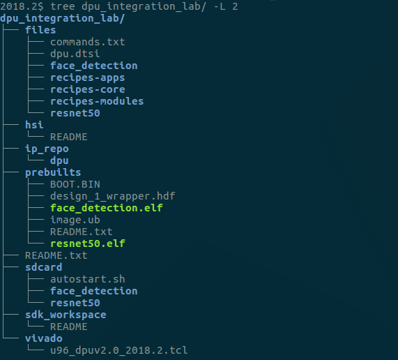
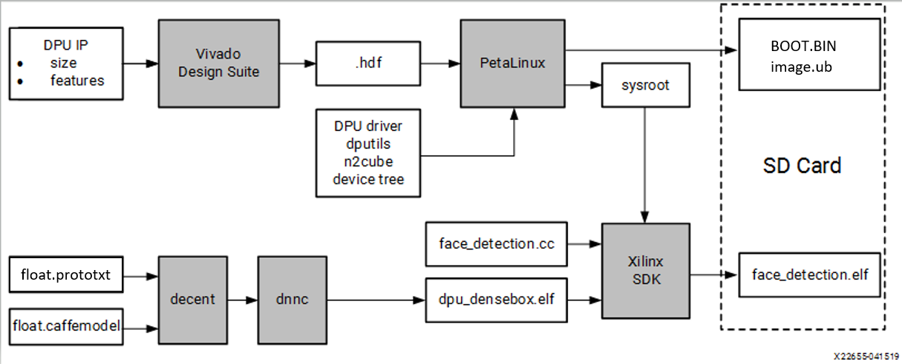
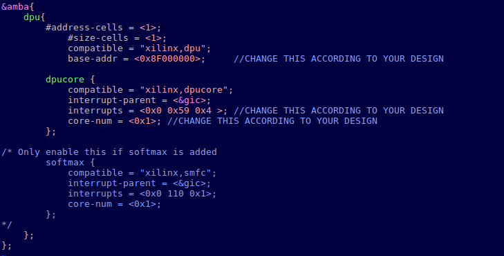
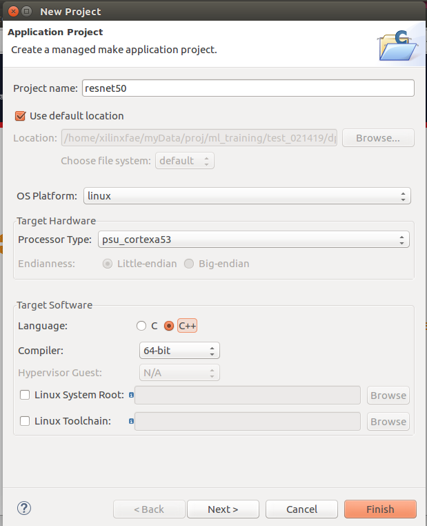
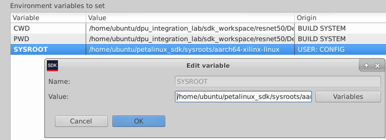
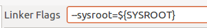
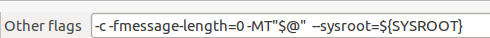
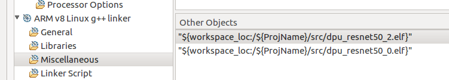
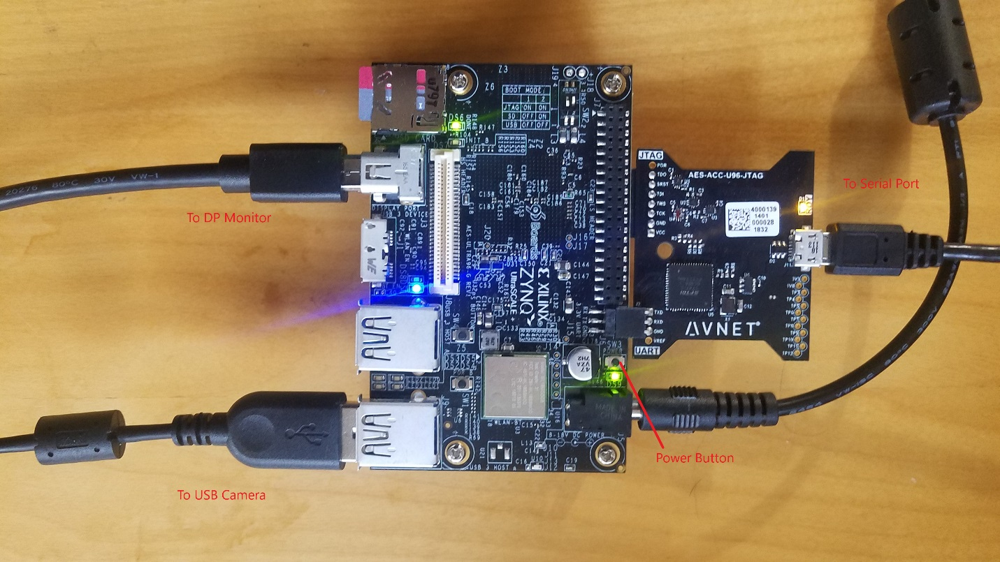

<table>
<tr>
  <td colspan="4" align="center"><h1>Edge AI Tutorials</h1>
  </td>
</tr>
<tr>
<td colspan="4" align="center"><h1>DPU Integration Tutorial</h1>
</td>
</tr>
</table>

# Introduction

This tutorial demonstrates how to build a custom system that utilizes the DPU v2.0 (v1.4.0 architecture) of the Xilinx&reg; Deep Learning Processor (DPU) IP to accelerate machine learning algorithms using the following development flow:

1. Build the hardware platform in the Vivado&reg; Design Suite.

2. Generate the Linux platform in PetaLinux.

3. Use Xilinx SDK to build two machine learning applications that take advantage of the DPU.

**Note:**

* The Ultra96 will be the targeted hardware platform. The DPU IP and yocto recipes are based on the ZCU102 DPU TRD v2.0, which can be downloaded [here.](https://www.xilinx.com/products/design-tools/ai-inference/ai-developer-hub.html#edge)
* This tutorial uses the DPU B1152. Pre-built model .elfs are also provided for the B2304.


# Requirements for Using the Xilinx DPU
This section lists the software and hardware tools required to use the Xilinx&reg; Deep Learning Processor (DPU) IP to accelerate machine learning algorithms.
## Software Requirements
* Vivado&reg; Design Suite 2018.2

* Board files for Ultra96 v1 should be installed

* Xilinx SDK 2018.2
* PetaLinux 2018.2

 **Note:** This tutorial is known to work with Vivado/Petalinux/SDK v2018.3, but 2018.2 will provided the best experience at this time. To use it with 2018.3, you will need to make the following changes:

 1. Edit the `u96_dpuv2.0_2018.2.tcl` script to specify 2018.3.

 2. Change the `petalinux-image.bbappend` to `petalinux-image-full.bbappend`.


## Hardware Requirements


* The Ultra96 board

* 12V power supply for Ultra96

* MicroUSB to USB-A cable

* AES-ACC-USB-JTAG board

* A blank, FAT32 formatted microSD card

* DisplayPort monitor (Optional)

* Mini-display port cable suitable for the chosen monitor  (Optional)

* USB Webcam  (Optional)

Download and extract the full tutorial archive from this repository and move the DPU Integration/reference-files sub-directory to your working area. Rename this directory to "dpu_integration_lab". You should end up with a directory structure as shown in the following figure:



The folders are:

- **files:** Petalinux/Yocto recipes, source code for SDK, etc.

- **hsi:** Directory for handing off `.hdf` files from the Vivado Design Suite to PetaLinux

- **ip_repo:** Repository for the DPU IP

- **prebuilts:** Includes a  pre-built `.hdf` file exported from the Vivado Design Suite, and a complete set of files to boot from the SD card and run applications

- **sdk_workspace:** Empty Eclipse workspace to be used for Xilinx SDK application development

- **vivado:** The Vivado Design Suite working directory includes an archived project for Ultra96 as well as a `.tcl` script to create a working `.bd`

- **sdcard:** Staging area for creating the SD Card image

From here, the location of the root lab directory will be referred to as ``<PROJ ROOT>``.

**TIP:** There is a file called commands.txt in the files directory, that has most of the commands required for the lab. Copy and paste the file from this location to save time.

# Project Overview
The high-level tool flow is shown in the following figure:



## Vivado Design Suite

1. Create a new project for the Ultra96.

2. Add the DPU IP to the project.

3. Use a `.tcl` script to hook up the block design in the IP integrator.

4. Examine the DPU configuration and connections.

5. Generate the bitstream.

6. Export the `.hdf` file.

## PetaLinux

1. Create a new PetaLinux project with the "Template Flow."

2. Add some new Yocto Recipes and recipe modifications.

3. Import the `.hdf` file from the Vivado Design Suite.

4. Configure some Ultra96-specifc hardware options.

5. Add some necessary packages to the root filesystem.

6. Update the device-tree to add the DPU.

7. Build the project.

8. Create a boot image.

## Xilinx SDK

1. Create new application projects for resnet50 and face detection.

2. Import the application source code and model `.elfs` generated by `dnnc`.

3. Update the application settings to point to sysroot, include needed libraries, etc.

4. Build the applications.

# Building the Hardware Platform in the Vivado Design Suite

## Step 1: Create a project in the Vivado&reg; Design Suite

1. `cd` into the Vivado directory and launch Vivado.

  ```
  cd <PROJ ROOT>/vivado/
  vivado
  ```

2. Create a new project based on the Ultra96 boards files:

     - Project Name: **project_1**

     - Project Location: `<PROJ ROOT>/vivado`

     - Do not specify sources

     - Select **Ultra96v1 Evaluation Platform**

      **Note:** Make sure you select the v1 option. The U96v1 Board Files are not a part of the standard Vivado installation. They must be installed separately. It is assumed that this step is already completed.

3. Click **Finish**.

## Step 2: Add the IP repository (containing the DPU IP) to the IP catalog
  1. Click **IP Catalog** in the Project Manager.

  2. Right-click **Vivado Repository** and select **Add Repository**.

  3. Select **<PROJ ROOT>/ip_repo**

    **Note:** You should see a message indicating that one repository and one IP is added.

## Step 3: Create the Block Design
  1. Open the TCL Console tab, `cd` to the `<PROJ ROOT>/vivado` directory, and source the `.tcl` script that has been provided to create the IP integrator block design for you:

     ```
     source u96_dpuv2.0_2018.2.tcl
     ```

  2. When the block design is complete, right-click on the **design_1** in the Sources tab and select **Create HDL Wrapper**.

  3. Accept the default options.

  

  4. Analyze the components and connections in the block design before continuing.

**Note**:
- When using the B2304 in the ZU3EG device found on the Ultra96, you must set the DSP Usage to Low in the DPU configuration GUI.  
-  When setting the RAM Usage to Low, the DPU is compatible with DNNC v1.4.0. When setting the RAM usage to High, DNNC v1.4.0.1 must be used to generate compatible instructions.


## Step 4: Copy the pre-built `.hdf` to the `hsi` directory (Optional)

 To save time, we can skip building the Vivado project  and manually export a pre-built `.hdf` file to the directory where the PetaLinux flow expects it. To use the pre-built option, execute the following command to copy the pre-built `.hdf` into the project:

```
cd <PROJ ROOT>
cp prebuilts/design_1_wrapper.hdf hsi
```

You can now skip to the PetaLinux section.

## Step 5: Generate the bitstream

1. Click **Generate Bitstream**.

2. Accept the defaults.

  **Note:** This step will take about 45 minutes, depending on the machine.

## Step 6: Export hardware

  When the bitstream generation process is complete, do the following steps to export the `.hdf` for use by PetaLinux:
  1. Click **File** > **Export** > **Export Hardware**.

  2. Make sure to include the bitstream.

  3. Export the hardware platform to `<PROJ ROOT>/hsi`.

  4. Click **OK**.

     

# Generating the Linux Platform in PetaLinux
You can begin with the PetaLinux flow, once the hardware definition file (`.hdf`) is exported from the Vivado&reg; Design Suite. At this point, you should have exported the `.hdf` to the `<PROJ ROOT>/hsi` directory.

**Tip:** To speed up text entry, use `commands.txt` file from the `<PROJ ROOT>/files` to copy and paste most of the commands. It is highly recommended that you copy and paste the commands to avoid command-line errors.

## Step 1: Create a PetaLinux project

Use the following command to create a new PetaLinux project based on the Zynq&reg; UltraScale+ template in a new directory named `petalinux`. This project is not based on an existing BSP.
```
source /opt/xilinx/petalinux/2018.2/settings.sh
cd  <PROJ ROOT>
petalinux-create -t project -n petalinux --template zynqMP
cd petalinux
```
## Step 2: Copy recipes to the PetaLinux project

In this step, you will add or edit some Yocto recipes to customize the kernel and rootfs and add the dnndk files.

**Note:** Make sure to `cd` in the PetaLinux directory first.

1. Add a recipe to add the DPU utilities, libraries, and header files into the root file system.
```
cp -rp ../files/recipes-apps/dnndk/ project-spec/meta-user/recipes-apps/
```
2. Add a recipe to build  the DPU driver kernel module.
```
cp -rp ../files/recipes-modules project-spec/meta-user
```
3. Add a recipe to create hooks for adding an “austostart” script to run automatically during Linux init.
```
cp -rp ../files/recipes-apps/autostart project-spec/meta-user/recipes-apps/
```
4. Add a `bbappend` for the base-files recipe to do various things like auto insert the DPU driver, auto mount the SD card, modify the PATH, etc.
```
cp -rp ../files/recipes-core/base-files/ project-spec/meta-user/recipes-core/
```


## Step 3: Configure PetaLinux to install the `dnndk` files

  ```
  vi project-spec/meta-user/recipes-core/images/petalinux-image.bbappend
  ```

  Add the following lines:

  ```
    IMAGE_INSTALL_append = " dnndk"
    IMAGE_INSTALL_append = " autostart"
    IMAGE_INSTALL_append = " dpu"
  ```

## Step 4: Point the PetaLinux build system to the `.hdf` file exported from the Vivado Design Suite

1. Use the following command to open the top-level PetaLinux project confguration GUI:

  ```
  petalinux-config --get-hw-description=../hsi
  ```

2. Change the serial port to `psu_uart_1`.

  ```
  Subsystem AUTO Hardware Settings->Serial Settings->Primary stdin/stdout = psu_uart1
  ```

  **Note:** The UART that connects to the USB JTAG/UART board is `psu_uart_1`.

  

3. Select **Ultra96 Machine**.

     ```
     DTG Settings -> MACHINE_NAME = zcu100-revc
     ```

     **Note:** The Ultra96 was originally called zcu100.

      **Tip:** Use backspace to delete the default text, then add **zcu100-revc**.

      By doing this, the build system uses the Ultra96-specific device-tree files.

      

4. Exit and save the changes.  This step will take a few minutes.

## Step 5: Configure the rootfs

Use the following to open the top-level PetaLinux project configuration GUI.

  ```
  petalinux-config -c rootfs
  ```

1. Enable each item listed below:

   **Note:** Do not enable the dev or dbg packages.

   **Petalinux Package Groups ->**

      - matchbox
   - opencv
   - v4lutils
   - x11

   **Apps ->**

      - autostart

   **Filesystem Packages ->**   

   - libs->libmali-xlnx->libmali-xlnx

**Modules ->**

      - dpu

   **User Packages ->**

      - dnndk


2. Exit and save the changes.


## Step 6: Add DPU to the device tree

At this time, the DPU is not supported by the device-tree generator. Therefore, we need to manually add a device-tree node to the DPU, based on our hardware settings.

  At the bottom of `project-spec/meta-user/recipes-bsp/device-tree/files/system-user.dtsi`, add the following text:

  

  **Tip:** You can copy and paste the amba node from `<PROJ ROOT>/files/dpu.dtsi`.


#### Interrupt Values

<table>
<tr>
<td><b>PS Interface</b></td>
<td><b>GIC IRQ #</b></td>
<td><b>Linux IRQ #</b></td>
</tr>
<tr>
<td>PL_PS_IRQ1[7:0]</td>
<td>143:136</td>
<td>111:104</td>
</tr>
<tr>
<td>PL_PS_IRQ0[7:0]</td>
<td>128:121</td>
<td>96:89</td>
</tr>
</table>
To calculate interrupt number(that is, the Linux IRQ), subtract 32 from the GIC IRQ number. For example, in the Vivado project, we connected to `PL_PS_IRQ0[0]` whose GIC IRQ number is 121 (as per TRM).
Therefore, the Linux IRQ number is 121-32 = 89 (0x59).

In the device tree, each interrupt 3-tuple is defined as follows:

<table>
<tr>
<td><b>Interrupt</b></td>
<td><b>Description</b></td>
</tr>
<tr>
<td>1st Cell</td>
<td>0 = Shared Peripheral Interrupt (SPI)<br>1 = Processor to Processor Interrupt (PPI)</td>
</tr>
<tr>
<td>2nd Cell</td>
<td>Linux Interrupt number</td>
</tr>
<tr>
<td>3rd Cell</td>
<td>1 = rising edge<br>2 = falling edge<br>4 = level high<br>8 = level low</td>
</tr>
</table>

#### Adding more DPU Cores

  If the DPU IP is configured to use more than one core, you will need multiple sets of interrupts, and the `core-num` parameter should be updated accordingly. For example, if you have three cores, `interrupts` and `core-num` should be set to the following values, assuming the interrupts are connected to `PL_PS_IRQ0[2:0]`:

  ```
  interrupts = <0x0 0x59 0x4 0x0 0x5a 0x4 0x0 0x5b 0x4 >;
  core-num = <0x3>;
  ```


## Step 7: Build the kernel and root file system

  ```
  petalinux-build
  ```

## Step 8: Create the boot image

  ```
  cd images/linux

  petalinux-package --boot --fsbl zynqmp_fsbl.elf --u-boot u-boot.elf /
  --pmufw pmufw.elf --fpga system.bit --force
  ```

## Step 9: Create sysroot

The `sysroot` is required to build applications against the libraries/header files that are provided by some of the packages that are built into the root file system.

#### Installing the Pre-Built SDK

Running through the full process to rebuild the SDK can take over an hour to complete. Therefore, a pre-built SDK has been provided with the tutorial files.

To download the pre-built SDK file, download and extract the zip file [from this link](https://www.xilinx.com/cgi-bin/docs/rdoc?v=2018.3;d=ug1350-design-files.zip), then copy the `sdk.sh` file to `../files`.

To install the pre-built SDK, use the following command:

  ```
  cd <PROJ ROOT>/petalinux
  petalinux-package --sysroot -s  ../files/sdk.sh
  ```

#### Rebuilding the SDK

If you want to go through full process to rebuild the SDK, use the following steps:

1. Run the following command to build a Yocto SDK and copy it to `<PROJ ROOT>/petalinux/images/linux/sdk.sh`:

  ```
  petalinux-build --sdk
  ```

2. Run the following command to extract and install the generated SDK and sysroot into the specified directory:

  ```
  petalinux-package --sysroot -d <directory>
  ```

**Note:** If you do not specify the directory (`-d`), the SDK will be installed at `images/linux/sdk`.

# Build Machine Learning Applications Using Xilinx SDK

Use the following steps to build two machine learning applications that take advantage of the DPU, using the Xilinx&reg; SDK:

## Step 1: Launch Xilinx SDK

Run the following command to launch the Xilinx SDK GUI:

```
xsdk
```

When the GUI opens, browse to the empty workspace at `<PROJ ROOT>/sdk_workspace`.

## Step 2:	Create a New Application Project

Use the following steps to create a new application project:

1. Click **File** and select **New Application Project**

2. Enter the parameters as follows:
      - Name: **resnet50**
      - OS Platform: **Linux**
      - Processor Type: **psu_cortexa53**
      - Language: **C++**


3. Click **Next**

4. Select **Empty Application**

5. Click **Finish**.



## Step 3: Import Source Files and Model .elf Files

Use the following steps to import source files and model .elfs files:

1. Click **File** and select **Import** -> **General** -> **Filesystem**.

2. Browse to `<PROJ ROOT>/files/resnet50`.

3. Click **OK**.

4. Select **main.cc**. (NEED A NEW main.cc with only one kernel since average pooling is done on DPU)

5. Check if the `Into Folder` is set to **resnet50/src**.

6. Click **Finish**, and allow it to overwrite `main.cc`.

7. Follow the same steps to import the DPU model `.elf`, `dpu_resnet50_0.elf`

  **Note:** You can use the pre-built models from `<PROJ ROOT>/files/resnet50/B1152_1.4.0`, if you do not have your own.

## Step 4: Update the Application Build Settings

Use the following steps to update the application build settings:

1. Right-click on **resnet50 application** and select **C/C++ Build Settings**.

2. In **C/C++ Build** -> **Environment**, add SYSROOT and point to the the sysroots location. For example:

    ```
    ${workspace_loc}/../petalinux/images/linux/sdk/sysroots/aarch64-xilinx-linux
    ```

    

3. Point the compiler and the linker to SYSROOT:
    - g++ linker settings:

        **Miscellaneous** -> **Linker Flags** : `--sysroot=${SYSROOT}`

        
    - g++ compiler settings:

        **Miscellaneous** -> **Other Flags**:  `--sysroot=${SYSROOT}`
        
4. In the g++ linker libraries tab, add the following libraries:
    - n2cube

    - dputils

    - pthread

    - opencv_core

    - opencv_imgcodecs

    - opencv_highgui

      

5. In **g++ linker** -> **Miscellaneous**, add the model `.elfs` to **Other Objects**.

6. Add `dpu_resnet50_0.elf`  from the `resnet50/src directory`.
 **Note:** You can click **Workspace** to browse to the objects you want, as shown in the following figure (ignore the second .elf for this version of the tutorial):

  

  

    **Note:** This will cause the `.elfs` to be statically linked to the application. It is also possible to dynamically link these objects at runtime(not covered in this guide).

7. Click **OK**.
8. Right-click on the **resnet50** application and select **Build Project**.


## Step 5: Build the Face Detection Application

Use the following steps to build the face detection application:

1. Repeat Step 3, substeps 2 through 5 above.

2. Add the source file <PROJ ROOT>/files/face_detection/face_detection.cc.

3. Delete `main.cc` from the project.

4. Add `dpu_densebox.elf` from `<PROJ ROOT>/files/face_detection/B1152_1.4.0`, if you do not have your own.

5. Set the SYSROOT Environment Variable to the proper value.

6. Point to SYSROOT in compiler and linker miscellaneous settings.

7. Add the following libraries:
    - n2cube
    - dputils
    - opencv_core
    - opencv_imgcodecs
    - opencv_highgui
    - opencv_imgproc
    - opencv_videoio
    - pthread

8. For the g++ Linker Miscellaneous **Other Objects**, select `face_detection/src/dpu_densebox.elf`.

9. Click **OK**.

10. Right-click on the **face_detection** application and select **Build Project**.

# Working with Ultra96

## Setting up Ultra96

Use the following steps to set up Ultra96:

1. Connect a proper 12V power supply.

2. Connect the AES-ACC-USB-JTAG board.

3. Connect the Camera Mezzanine board to the Ultra96 (Optional)

4. Connect a microUSB cable between the AES-ACC-USB-JTAG and your PC.

5. Connect a second microUSB cable between from the Ultra96 USB3.0 connector to your PC for networking.

6. Connect a DisplayPort Monitor using a miniDisplayPort cable (Optional)

7. Connect a USB webcam to one of the host USB ports (Optional)

8. Prepare a blank microSD card with a single FAT32 partition.

      


# Running Applications on Ultra96

Next, we’ll gather all the images in a SD card staging area first, and then copy them all to the SD card at one time.  There is a directory in PROJ_ROOT called sdcard that already includes the directories for the applications and the test images for resnet50.  The test images are located in the  <PROJ ROOT>/sdcard/common/image500_640_480 directory.

## Step 1: Copy files to the SD card
Use the following steps to copy the files to the SD card:

1. Copy `<PROJ ROOT>/petalinux/images/linux/image.ub` and `BOOT.BIN` to the `sdcard` directory.

2. Copy `<PROJ_ROOT>/sdk_workspace/resnet50/Debug/resnet50.elf` to the `sdcard/resnet50` folder.

3. Copy `<PROJ_ROOT>/sdk_workspace/face_detection/Debug/face_detection.elf` to the `sdcard/face_detection` folder.

   cd im

   You can  copy and paste the following commands:

 ```
  cd <PROJ ROOT>
  cp petalinux/images/linux/image.ub sdcard
  cp petalinux/images/linux/BOOT.BIN sdcard
  cp sdk_workspace/resnet50/Debug/resnet50.elf sdcard/resnet50/
  cp sdk_workspace/face_detection/Debug/face_detection.elf  sdcard/face_detection/`
 ```

4. Copy all the files in the `sdcard` directory to a blank microSD card on your PC.

## Step 2:	Boot the Ultra96
Place the micro SD card into the Ultra96 and power on the board. Once the board has booted, login using the following credentials:
- username = **root**
- password = **root**


## Step 3: Initialize the display

There are two ways to display the results of the face detection application. You can either connect a display port monitor to the Ultra96, or you can stream the video over the network to a connected PC.

### Local Monitor

Run the commands below to prepare the display. If you include the autostart.sh on the SD card, this will happen automatically after boot. You'll still need to export the DISPLAY again, however.

```
v4l2-ctl --set-fmt-video=width=640,height=480,pixelformat=UYVY
export DISPLAY=:0.0
xrandr --output DP-1 --mode 800x600
xset s off -dpms
```

**Note:** Use `xrandr` to find a suitable mode for your monitor. When running at 1920x1080, the screen may flicker due to memory bandwidth issues.  

### Network Connected PC

There are two ways to connect to the Ultra96 over the network:

1. USB Ethernet adapter

   * Connect a USB Ethernet adapter to one of the USB Host ports on the board, and connect to your local network or directly to your PC.

2. RNDIS/Ethernet Gadget:

   * Connect a micro USB cable between the Ultra96 USB3.0 port and the PC with RNDIS support enabled.

   * After boot, issue the following commands to enable the interface:

     ```
     modprobe g_ether
     ifup usb0
     ```

     These commands are issues automatically if the autostart.sh script is used.

   ​

#### Connect with SSH and use X11-Forwarding to PC

On Windows, connect to the target over the network using an SSH client that provides an X-server, such as [MobaXterm](https://mobaxterm.mobatek.net/).  Ensure that X11-forwarding is enabled, and the DISPLAY environment variable is setup correctly.  When an application is launched from this shell, the output will be forwarded back to the PC and displayed in a separate window.

For Linux (or windows command line) you can use the following command:

* ssh -X root@[IP address of Ultra96].


## Step 4:	Run Resnet50

Change to the directory with the `resnet50` application and execute the program.
•	cd /media/card/resnet50
•	./resnet50.elf

## Step 5:	Run face detection

Change to the following directories with the face_detection application and execute the program.
- `cd /media/card/face_detection`
- `./face_detection.elf`

**Note:** If you see “Open camera error!”, try unplugging the USB camera and inserting it again. If it still isn’t recognized, try rebooting with the camera unplugged, then plug in the camera before launching the application. If both of these efforts fail, try a different camera.
