**DPU Integration Lab**

**v1.0**

**Lab Overview**

In this lab, we'll go through all of the steps necessary to build a
custom system that utilizes the Xilinx Deep Learning Processor (DPU) IP
to accelerate machine learning algorithms. We'll start in Vivado to
build the hardware platform, move to Petalinux to generate the Linux
platform, then finish up in Xilinx SDK to build two machine learning
applications that take advantage of the DPU.

The Ultra96 will be the targeted hardware platform.

**Tools Needed**

Vivado 2018.2

-   Board files for Ultra96 v1 should be pre-installed Xilinx SDK 2018.2

Petalinux 2018.2

These tools have been pre-installed on the AWS build server we'll use
for the lab.

**Hardware Needed**

Ultra96 Board

12V Power Supply for Ultra96

microUSB to USB-A cable

AES-ACC-USB-JTAG board

DisplayPort Monitor

miniDisplay Port Cable suitable for the chosen monitor A blank, FAT32
formatted microSD card USB webcam

**Project Archive**

The project archive has been pre-installed in the /home/ubuntu directory
of the AWS server.

-   To unzip the archive, use the following command: tar -xzf
    > dpu\_integration\_lab\_v1.0.tgz

This will create a directory named "dpu\_integration\_lab" with the
following directory structure:

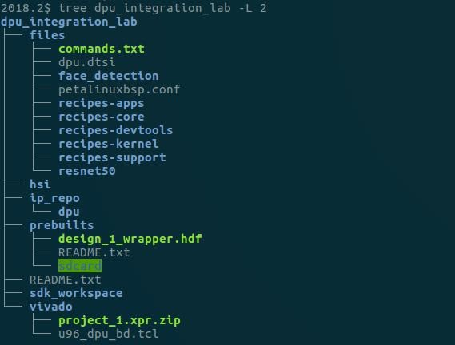

**files**: Petalinux/Yocto recipes, source code for SDK, etc.

**hsi:** directory for handoff of .hdf from Vivado to Petalinux

**ip\_repo**: Repository for the DPU IP

**prebuilts**: Includes a pre-built .hdf file exported from Vivado and a
complete set of files to boot from SD and run the applications

**sdk\_workspace:** Empty Eclipse workspace to be used for Xilinx SDK
application development **vivado:** Vivado working directory - includes
an archived project for Ultra96 as well as a .tcl script to create a
working .bd

From here on, the location of the root lab directory will be referred to
as \<PROJ ROOT\>.

Below is a high-level summary of the steps we'll be taking in the lab:

**Vivado Project Overview**

-   Create a new project for the Ultra96

-   Add the DPU IP to the project

-   Use a .tcl script to hook up the block design in IPI

-   Examine the DPU configuration and connections

-   \[Optional\] Copy the pre-built .hdf to the Petalinux project

-   Generate the bitstream

-   Export the .hdf

**Petalinux Project Overview**

-   Create a new Petalinux project with the \"Template Flow\"

-   Add some new Yocto Recipes and recipe modifications

-   Import the .hdf from Vivado

-   Configure some Ultra96-specifc hardware options

-   Add some necessary packages to the root filesystem

-   Update the device tree to add the DPU

-   Build the project

-   Create a boot image

**SDK Project Overview**

-   Create new application projects for resnet50 and face detection

-   Import the application source code and model .elfs generated by dnnc

-   Update the application settings to point to sysroot, include needed
    > libraries, etc

-   Build the applications

**Vivado Flow**

1.  **Create the Vivado Project**

    -   cd into the vivado directory and launch vivado:

> cd \<PROJ ROOT\>/vivado/ vivado

-   Create a new project based on the Ultra96 boards files:

o.  Create Project

<!-- -->

o.  Project Name: project\_1

<!-- -->

o.  Project Location: \<PROJ ROT\>/vivado

<!-- -->

o.  Do not specify sources

<!-- -->

o.  Select Ultra96v1 Evaluation Platform

    -   **Makes sure you select the v1 option - the U96v1 Board Files
        > are NOT part of the standard Vivado installation -- they must
        > be installed separately. This has**

> **already been done for this lab.**

o.  Click Finish

<!-- -->

2.  **Add the IP repository containing the DPU IP to the IP Catalog**

    -   Click \"IP Catalog\" in Project Manager

    -   Right Click on \"Vivado Repository\" and select \"Add
        > Repository\"

    -   Select \<PROJ ROOT\>/ip\_repo

> o You should see message indicating 1 IP was added

3.  **Create the Block Design**

    -   Open up the TCL Console tab, cd to the \<PROJ ROOT\>/vivado
        > directory and source the .tcl script: source u96\_dpu\_bd.tcl

    -   When the block design is complete, right click on design\_1 in
        > the Sources tab and select \"Create HDL Wrapper\"

    -   Accept the default options.

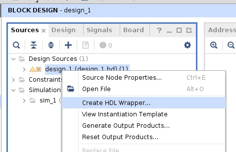

-   Spend a few minutes analyzing the components and connections in the
    > block design before continuing.

**What is the base address of the DPU slave interface?**
\_\_\_\_\_\_\_\_\_\_\_\_\_\_\_\_\_\_\_\_\_\_\_\_\_\_

**What PL-\>PS Interrupt number is connected to the DPU?**
\_\_\_\_\_\_\_\_\_\_\_\_\_\_\_\_\_\_\_\_\_\_\_

**4.** **\[OPTIONAL\] Copy the pre-built .hdf to the hsi directory**

To save time, we will skip building the Vivavdo project during this lab
session and "manually export" a pre-built .hdf file to the directory
where the Petalinux flow detailed below expects it.

To use the pre-built option, execute the following command to copy the
pre-built .hdf into the project:

cd \<PROJ ROOT\>

cp prebuilts/design\_1\_wrapper.hdf hsi

**To continue to the Petalinux flow, jump to the "Petaliunx Flow"
section below.**

To build the Vivado project, continue with step 5. This step will take
about 40 minutes.

**5. Generate the Bitstream**

This will take about 45 minutes depending on the machine.

-   Click Generate Bitstream.

-   Accept Defaults.

**6. Export Hardware**

When the bitstream generation process completes, export the .hdf for use
by Petalinux.

-   Click File-\>Export-\>Export Hardware

-   **Make sure you include the bitstream.**

-   Export the hardware platform to \<PROJ ROOT\>/his

-   Click OK

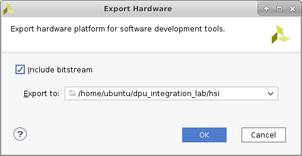

**Petalinux Flow**

The Petalinux flow can be started once a hardware definition file (.hdf)
has been exported from Vivado.

At this point you should have exported the .hdf to the \<PROJ ROOT\>/hsi
directory.

To speed up text entry, there is a file in \<PROJ ROOT\>/files called
commands.txt you can use to copy and paste most of the commands below.

**1.** **Create the Petalinux project**

source /opt/xilinx/petalinux/2018.2/settings.sh cd \<PROJ ROOT\>

petalinux-create -t project -n petalinux \--template zynqMP **cd
petalinux**

This command creates a new Petalinux project based on the Zynq US+
template in a new directory name "petalinux". We are not basing this
project on an existing BSP.

**2. Copy recipes to the petalinux project:**

In this step, we're adding/modifying some Yocto recipes to customize the
kernel and rootfs build, and add the dnndk files. Make sure you cd into
the petalinux directory first.

-   Add a recipe for OpenCV v3.1. This is the version needed by the DPU
    > libraries, but Petalinux builds v3.3 by default.

> cp -rp ../files/recipes-support project-spec/meta-user

-   Add a bbappend for the protobuf package to change the branch that
    > its source is pulled from. This is needed due to the OpenCV v3.1
    > change.

> cp -rp ../files/recipes-devtools project-spec/meta-user

-   Add a bbappend to modify the LINUX\_VERSION\_EXTENSION of the
    > kernel. This is needed to make the pre-built dpu kernel module
    > (dpu.ko) "version magic" match the kernel that we build.

> This will not be necessary once the DPU kernel sources are integrated
> into the kernel build. Without this change, dpu.ko will fail to be
> inserted at boot.
>
> cp -rp ../files/recipes-kernel project-spec/meta-user

-   Add a recipe to add the DPU driver, utilities, libraries, and header
    > files into the root file system.

> cp -rp ../files/recipes-apps/dnndk/
> project-spec/meta-user/recipes-apps/

-   Add a bbappend for the base-files recipe to do various things like
    > auto insert the DPU driver, auto mount the SD card, modify the
    > PATH, etc.

cp -rp ../files/recipes-core/base-files/
project-spec/meta-user/recipes-core/

-   Modify the Petalinux Yocto configuration to use OpenCV v3.1 instead
    > of v3.3

> cp ../files/petalinuxbsp.conf project-spec/meta-user/conf/

2.  **Configure Petalinux to install the dnndk files:**

<!-- -->

vi. project-spec/meta-user/recipes-core/images/petalinux-image.bbappend

    -   Add the following line:

> IMAGE\_INSTALL\_append = \" dnndk\"

**4. Point the Petalinux build system to the .hdf exported from Vivado**

petalinux-config \--get-hw-description=../hsi

This will cause the top-level Petalinux project configuration GUI to
open.

-   **Change the serial port to PSU\_UART1**

> The UART that connects to the USB JTAG/UART board is **psu\_uart\_1**.

Subsystem AUTO Hardware Settings-\>Serial Settings-\>Primary
stdin/stdout = psu\_uart1

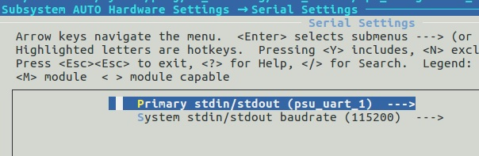

-   **Select the Ultra96 Machine (Ultra96 was originally called zcu100)
    > Hint**: use backspace to delete the default text, then add
    > zcu100-revc.

> DTG Settings -\> MACHINE\_NAME = zcu100-revc
>
> This causes the build system to use the Ultra96-specific device tree
> files

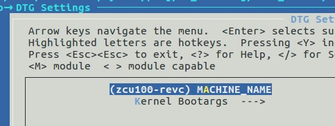

> • Exit and save the changes. This will take about 5-7 minutes to
> complete.

5.  **Configure the Root FS**

petalinux-config -c rootfs

This will cause the top-level Petalinux project configuration GUI to
open.

-   Enable each item listed below:

> **Petalinux Package Groups -\>** o opencv
>
> o X11
>
> o v4lutils
>
> **Apps -\>** o dnndk
>
> **Filesystem Packages \_\>**
>
> o console-\>tools-\>protobuf (Note: this is related to the OpenCV
> modification)
>
> • Exit and Save the changes.

6.  **Add the DPU to the Device Tree**

The DPU is not supported by device tree generator at this time, so we
need to manually add a device tree node for the DPU based on our
hardware settings.

-   At the bottom of
    > project-spec/meta-user/recipes-bsp/device-tree/files/system-user.dtsi,
    > add the following text:

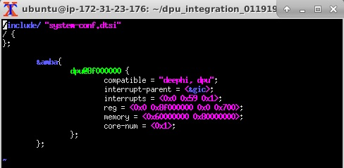

> **Hint**: You can copy and paste the amba node from \<PROJ
> ROOT\>/files/dpu.dtsi

-   Continue to step 7 -- The information below is added for reference:

Note: In this version of the DPU driver, only the interrupts and
core-num parameters are being parsed. The DPU **MUST** be located at
address 0x8F000000 -- the "reg" parameter is ignored, as is the "memory"
parameter.

**Interrupt values**

+-----------------------+------------+----------------+
| > PS Interface        | GIC IRQ \# | > Linux IRQ \# |
+-----------------------+------------+----------------+
|                       |            |                |
+-----------------------+------------+----------------+
| > PL\_PS\_IRQ1\[7:0\] | 143:136    | > 111:104      |
+-----------------------+------------+----------------+
|                       |            |                |
+-----------------------+------------+----------------+
| > PL\_PS\_IRQ0\[7:0\] | 128:121    | > 96:89        |
+-----------------------+------------+----------------+
|                       |            |                |
+-----------------------+------------+----------------+

To get the interrupt number to put in the device tree, subtract 32 from
GIC IRQ to get Linux IRQ

For example, in our Vivado project, we connected to PL\_PS\_IRQ0\[0\]
which is GIC IRQ\# 121. 121-32 = **89 (0x59)**

In the device tree, each interrupt 3-tuple is defined as follows:

1^st^ Cell: 0 for Shared Peripheral Interrupt (SPI), 1=Processor to
Processor Interrupt (PPI)

2^nd^ Cell: Linux Interrupt number

3^rd^ Cell: 1=Rising edge,2=Falling edge, 4=level high, 8=level low

**Adding more DPU cores**

If your DPU IP is configured to use more than one core, you\'ll need
multiple sets of interrupts, and the core-num parameter should be
updated accordingly. For example, if you have 3 cores, interrupts and
core-num should be set to the following, assuming the interrupts are
connected to PL\_PS\_IRQ0\[2:0\]:

interrupts = \<0x0 **0x59** 0x1 0x0 **0x5a** 0x1 0x0 **0x5b** 0x1 \>;
core-num = \<0x3\>;

**7. Build the kernel and Root File System**

petalinux-build

Note: On the AMI we're using in this session, this step will take about
55 minutes.

[STOP -- Skip to the SDK Flow Section and return here when the petalinux
build process is complete]{.underline}

**8. Create the boot image**

cd images/linux

petalinux-package \--boot \--fsbl zynqmp\_fsbl.elf \--u-boot u-boot.elf
\-- pmufw pmufw.elf \--fpga system.bit \--force

**9. Create sysroot**

We need \"sysroot\" so we can build applications against the
libraries/header files provided by some of the packages that are built
into the root filesystem.

**Building the Yocto SDK in order to get sysroot takes 1hr 40 min on the
AWS server, so the SDK has been pre-built and installed at
\~/petalinux\_sdk**

To build it, you would use the following commands:

petalinux-build \--sdk

o.  This builds a Yocto SDK and copies it \<PROJ
    > ROOT\>/petalinux/images/linux/sdk.sh

petalinux-package \--sysroot -d \<directory\>

o.  This extracts and installs the generated SDK and sysroot into the
    > directory specified

<!-- -->

o.  If -d is not specified, it will be installed at images/linux/sdk

**Xilinx SDK Flow**

1.  **Launch XSDK**

    -   Run the following command to launch the Xilinx SDK GUI: xsdk

    -   When the GUI opens, browse to the empty workspace at \<PROJ
        > ROOT\>/sdk\_workspace

2.  **Create a new application project**

    -   File-\>New Application Project

    -   **Name**: resnet50

    -   **OS Platform**: Linux

    -   **Processor Type**: psu\_cortexa53

    -   **Language**: C++

    -   Click Next

    -   Choose \"Empty Application\"

    -   Click Finish

3.  **Import source files and model .elfs**

    -   File-\>Import-\>General-\>Filesystem

        -   Browse to \<PROJ ROOT\>/files/resnet50

-   Click OK

-   Select main.cc

-   Make sure \"Into Folder\" is set to resnet50/src

-   Click Finish, allow it to overwrite main.cc

<!-- -->

-   Use the same method to import the DPU model .elfs,
    > dpu\_resnet50\_0.elf and dpu\_resenet50\_2.elf

-   Note: You can use the pre-built models from \<PROJ
    > ROOT\>/files/resnet50/B1152\_1.3.0, OR you can use the models that
    > were generated as part of the previous DNNDK lab at
    > \~/model\_handoff/

3.  **Update Application Build Settings**

    -   Right Click on the resnet50 application and select \"C/C++ Build
        > Settings\"

        -   In C/C++ Build-\>Environment, add SYSROOT and point to:

            -   To use the pre-built sysroot for this lab:
                > /home/ubuntu/petalinux\_sdk/sysroots/aarch64-xilinx-linux

> OR
>
> To use the default location when building sysroot on your own:
>
> \${workspace\_loc}/../petalinux/images/linux/sdk/sysroots/aarch64-xilinx-linux

-   Point the compiler and the linker to SYSROOT:

<!-- -->

-   g++ Linker settings:

> Micellaneous-\>Linker Flags: \--sysroot=\${SYSROOT}

-   g++ compilier settings:

> Miscellaneous-\>Other Flags: \--sysroot=\${SYSROOT}

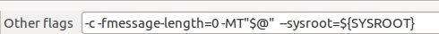

-   In the g++ linker Libraries tab, add the following libraries:

    -   n2cube

    -   dputils

    -   opencv\_core

    -   opencv\_imgcodecs

    -   opencv\_highgui

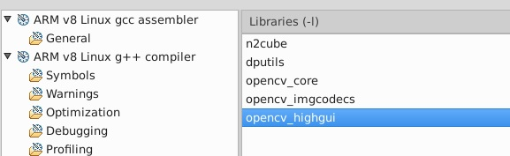

-   In g++ linker-\>Miscellaneous, add the model .elfs to \"Other
    > Objects\"

    -   Add dpu\_resnet50\_0.elf and dpu\_resnet50\_2.elf from the
        > resnet50/src directory. **Note**: You can use the
        > \"Workspace...\" button and browse to the objects you want,
        > selecting both:

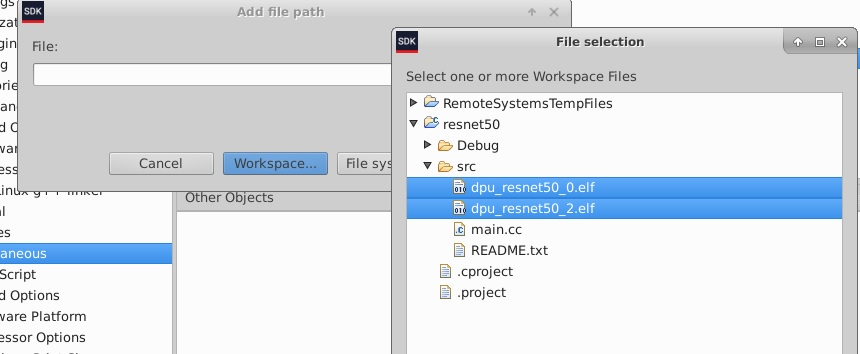

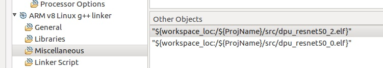

> Note: This will cause the .elfs to be statically linked to the
> application. It\'s also possible to dynamically link these objects at
> runtime, but that method is not covered in this lab.

-   Click OK

<!-- -->

-   Right click on the resnet50 app and select Build Project.

4.  **Build the Face Detection Application**

    -   Repeat steps 2 through 5 above to create the "face\_detection"
        > application with the changes below:

        -   Add the source file \<PROJ
            > ROOT\>/files/face\_detection/face\_detection.cc

        -   Delete main.cc from the project

        -   Add dpu\_densebox.elf from \<PROJ
            > ROOT\>/files/face\_detection/B1152\_1.3.0,

> OR if using the outputs from the previous dnnc lab, add the model .elf
> from \~/model\_handoff

-   Set the SYSROOT Environment Variable to the proper value

-   Point to SYSROOT in compiler and linker miscellaneous settings

-   In addition to the libraries above, add the following:

    -   opencv\_imgproc

    -   opencv\_videoio

    -   pthread

-   For the g++ Linker Miscellaneous \"Other Objects\", choose
    > face\_detection/src/dpu\_densebox.elf

-   Click OK

<!-- -->

-   Right click on the face\_detection app and select Build Project.

**Setting up the Ultra96**

1.  **Connect a proper 12V power supply**

2.  **Connect the AES-ACC-USB-JTAG board**

3.  **Connect a microUSB cable between the AES-ACC-USB-JTAG and your
    PC**

4.  **Connect a DisplayPort Monitor using a miniDisplayPort cable**

5.  **Connect a USB webcam to one of the host USB ports**

6.  **Prepare a blank microSD card with a single FAT32 partition (this
    is done for you)**

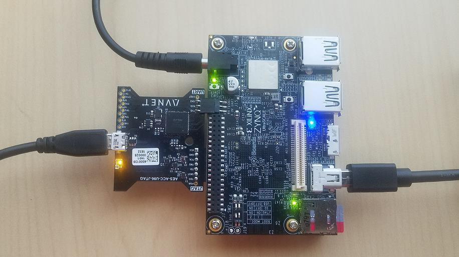

**Running the Applications on the Ultra96**

Note: when running on a remote server such as AWS, it\'s a good idea to
create an intermediate directory to collect the images referenced below
before moving them to the PC used to write the SD card. For this
example, we\'ll assume there is a directory at \~/sdcard to gather the
images.

1.  **Copy Files to the SD Card**

    -   copy \<PROJ ROOT\>/petalinux/images/linux/image.ub & BOOT.BIN to
        > the card

    -   copy \<PROJ ROOT\>prebuilts/sdcard/common to the card (this
        > includes the images for the resnet50 demo)

    -   create a directories called /resnet50 and /face\_detection

    -   copy \<PROJ\_ROOT\>/sdk\_workspace/resnet50/Debug/resnet50.elf
        > to the /resnet50 folder

    -   copy
        > \<PROJ\_ROOT\>/sdk\_workspace/face\_detection/Debug/face\_detection.elf
        > to the /face\_detection folder

    -   You can copy and paste the commands below to execute the steps
        > above:

cd \<PROJ ROOT\>

cp petalinux/images/linux/image.ub \~/sdcard cp
petalinux/images/linux/BOOT.BIN \~/sdcard cp -rp prebuilts/sdcard/common
\~/sdcard mkdir \~/sdcard/resnet50 mkdir \~/sdcard/face\_detection

cp sdk\_workspace/resnet50/Debug/resnet50.elf \~/sdcards/resnet50/ cp
sdk\_workspace/face\_detection/Debug/face\_detection.elf
\~/sdcards/face\_detection/

-   Next, copy the files in \~/sdcard to a blank microSD card on your PC
    > using WinSCP

-   Right click on the card in windows explorer, and select Eject

    -   make sure you change out of that directory if it\'s open in
        > WinSCP

1.  **Boot the Ultra96**

    -   Place the microSD card into the Ultra96 and power on the board.

    -   Once the board has booted, login with username=root,
        > password=root.

2.  **Initialize the display and camera**

    -   Run the commands below to prepare the display and camera
        > sub-systems for running the application:

xinit /etc/X11/Xsession&

sleep 5

export DISPLAY=:0.0

v4l2-ctl \--set-fmt-video=width=640,height=480,pixelformat=YUYV xrandr
\--output DP-1 \--mode 640x480 xset -dpms

> **4. Run Resnet50**

Change to the directory with the resnet50 application and execute the
program

-   cd /media/card/resnet50

-   ./resnet50.elf

> **5. Run Face Detection**

Change to the directory with the face\_detection application and execute
the program

-   cd /media/card/face\_detection

-   ./face\_detection

