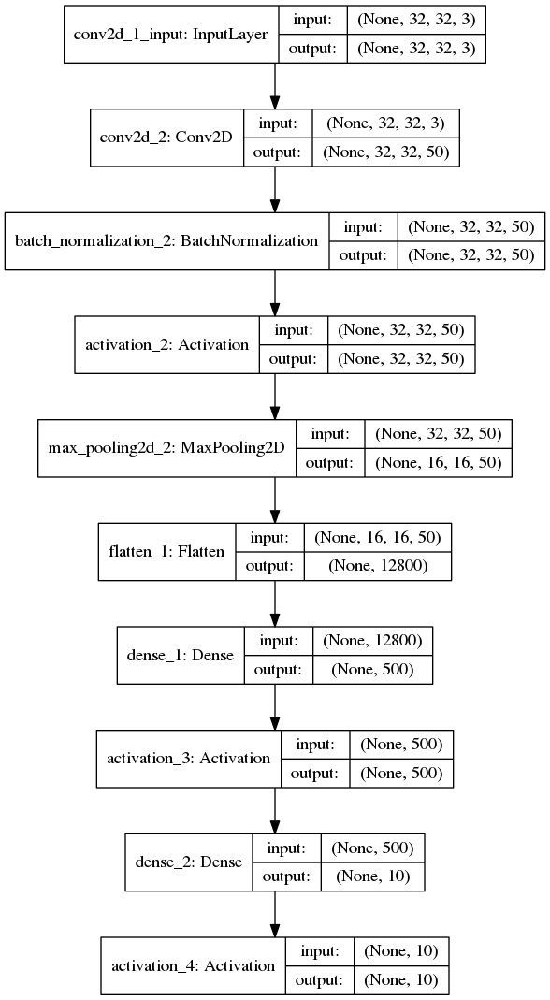
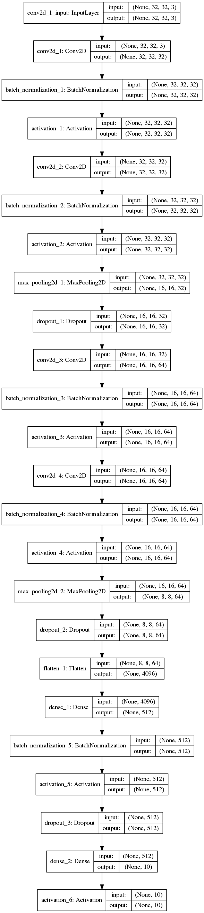
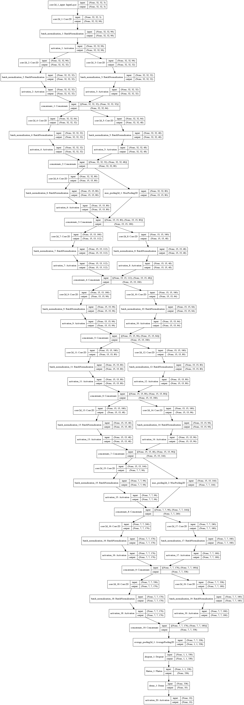
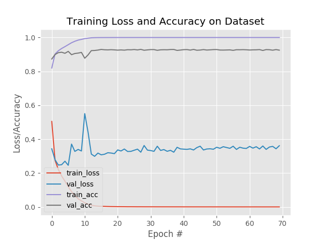
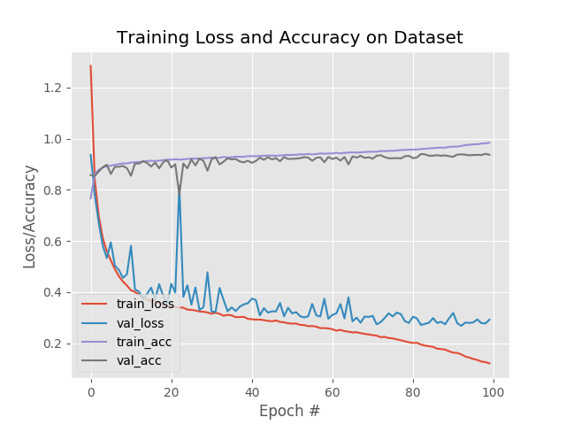
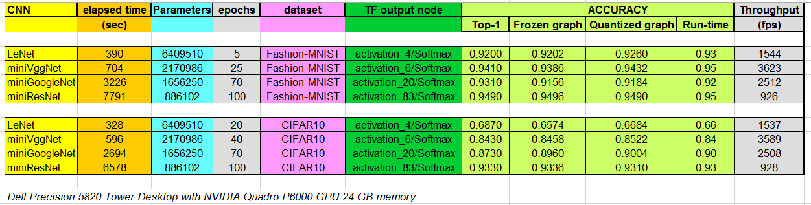

<div style="page-break-after: always;"></div>
<table style="width:100%">
  <tr>
    <th width="100%" colspan="6"><h1>Deep Learning with Custom GoogleNet and ResNet in Keras and Xilinx DNNDK TensorFlow 3.1</h1>
</th>
  </tr>
</table>
</div>

# Introduction

In this Deep Learning (DL) tutorial, you will quantize in fixed point some custom convolutional neural networks (CNNs) and deploy them on the Xilinx&reg; ZCU102 board using Keras and the Xilinx DNNDK 3.1 tool chain based on TensorFlow (TF). All the CNNs are modeled and trained directly in Keras and then transformed into TF inference graphs before being deployed on the target board.

This tutorial includes the following:

1. Highly software engineered Python code with all the global variables stored in a [configuration file](code/config/fashion_mnist_config.py) to decrease redundancy.
2. Templates that can easily be re-adapted, with minimum changes, for similar use-cases.
3. Some custom CNNs, from the simplest ``LeNet`` and ``miniVggNet`` to the intermediate ``miniGoogleNet`` and the mre complex ``miniResNet``, as described in the [custom_cnn.py](code/custom_cnn.py) file.
4. Links to all the public domain material found on the Internet.
5. Logfiles of any processing step captured and stored into an [rpt](rpt) directory.
6. Two different datasets, ``Fashion-MNIST`` and ``CIFAR10``, each one with 10 classes of objects.

Once the selected CNN has been correctly trained in Keras, the [HDF5](https://www.hdfgroup.org/solutions/hdf5/) file of weights is converted into a TF checkpoint and inference graph files, and then the frozen graph is quantized by the Xilinx DNNDK TF 3.1 toolchain. The `elf` file for the Xilinx Edge AI Platform is created and executed on the ZCU102 target board. The top-1 accuracy of the predictions computed at run time is measured and compared with the simulation results. The following flow is used to accomplish this:

1. Organize the data into folders, such as ``train`` for training, ``val`` for validation during the training phase, ``test`` for testing during the inference/prediction phase, and ``cal`` for calibration during the quantization phase, for each dataset. See [Organizing the Data](#organizing-the-data) for more information. From the host PC, run the following command:
```
source ./0_generate_images.sh # generate images of both datasets
```
2. Train the CNNs in Keras and generate the HDF5 weights model. See [Training the CNN](#training-the-cnn) for more information. From the host PC, run the following  commands:
```
source ./1_fmnist_train.sh  #only for Fashion-MNIST
source ./1_cifar10_train.sh #only for CIFAR10
```
3. Convert into TF checkpoints and inference graphs. See [Creating TF Inference Graphs from Keras Models](#creating-tf-inference-graphs-from-keras-models) for more information. From the host PC, run the following  commands:
```
source ./2_fmnist_Keras2TF.sh
source ./2_cifar10_Keras2TF.sh
```

4. Freeze the TF graphs to evaluate the CNN prediction accuracy as the reference starting point. See [Freezing the TF Graphs](#freezing-the-tf-graphs) for more information. From the host PC, run the following commands:
```
source ./3a_fmnist_freeze.sh
source ./3b_fmnist_evaluate_frozen_graph.sh
source ./3a_cifar10_freeze.sh
source ./3b_cifar10_evaluate_frozen_graph.sh
```

5. Quantize from 32-bit floating point to 8-bit fixed point and evaluate the prediction accuracy of the quantized CNN. See [Quantizing the Frozen Graphs](#quantizing-the-frozen-graphs) for more information. From the host PC, run the following commands:
```
source ./4a_fmnist_quant.sh
source ./4b_fmnist_evaluate_quantized_graph.sh
source ./4a_cifar10_quant.sh
source ./4b_cifar10_evaluate_quantized_graph.sh
```

6. Write the C++ application and then compile the ``elf`` file for the target board. See [Compiling the Quantized Models](#compiling-the-quantized-models) for more information. From the host PC, run the following commands:
```
source ./5_fmnist_compile.sh
source ./5_cifar10_compile.sh
```

7. Execute the ``elf`` file, during run-time, on the ZCU102 target board to measure the effective top-1 accuracy. See [Build and Run on Target Board](#build-and-run-on-the-target-board) for more information. From the target board, run the following command:
```
source ./run_on_target.sh
```
For more information see [How to Convert a Trained Keras Model to a Single TensorFlow .pb file and Make Prediction](https://www.dlology.com/blog/how-to-convert-trained-keras-model-to-tensorflow-and-make-prediction/) and its related [GitHub code](https://github.com/Tony607/keras-tf-pb), and the Xilinx Edge AI Tutorial [MNIST classification with TensorFlow and Xilinx DNNDK](https://github.com/Xilinx/Edge-AI-Platform-Tutorials/tree/master/docs/MNIST_tf).

>**:pushpin: NOTE** All explanations in the following sections are based only on the Fashion-MNIST dataset; the commands for the CIFAR10 dataset are very similar: just replace the sub-string "fmnist" with "cifar10".

# Pre-requisites

- An Ubuntu 16.04 platform with the following tools installed:
  - Python 3.6

  - Edge AI tool chain release DNNDK v3.1 available from [Xilinx Edge AI Resources](https://www.xilinx.com/products/design-tools/ai-inference/ai-developer-hub.html#edge) Developer Hub (filename [xilinx_dnndk_v3.1_190809.tar.gz](https://www.xilinx.com/member/forms/download/dnndk-eula-xef.html?filename=xilinx_dnndk_v3.1_190809.tar.gz)). Note that it contains both versions with and without CUDA libraries.  Refer to the [DNNDK User guide UG1327 v1.6](https://www.xilinx.com/support/documentation/sw_manuals/ai_inference/v1_6/ug1327-dnndk-user-guide.pdf), if you want to install ``decent_q`` via Anaconda 3.

  - Edge AI Evaluation board [ZCU102](https://www.xilinx.com/products/boards-and-kits/ek-u1-zcu102-g.html) with image file [petalinux-user-image-zcu102-zynqmp-sd-20190802.img.gz](https://www.xilinx.com/member/forms/download/zcu102-image-license-xef.html?filename=petalinux-user-image-zcu102-zynqmp-sd-20190802.img.gz). Such image file contains a pre-built working design for the ZCU102 with the Edge AI Platform named Deep Processor Unit (shortly "DPU"), for more information about the DPU consults the [DPU Product Guide (PG338 v3.0)](https://www.xilinx.com/support/documentation/ip_documentation/dpu/v3_0/pg338-dpu.pdf).

  - CUDA 9.0 and cuDNN 7.0.5, if you want to run the training in a few minutes; otherwise, a CPU without any GPU support can complete the training process in about an hour for the ``miniVggNet``. Note that other CNNs will take much more time.

  - Python [Virtual Environment](https://docs.python-guide.org/dev/virtualenvs/), as simpler alternative to Anaconda 3. For more information, refer to [Installing DNNDK TF with Python Virtual Environment (without Anaconda)](https://github.com/dannybaths/Installing_DNNDK_TF_3v0_with_Python_Virtual_Envs) (it was written for DNNDK 3.0 but it works fine also with 3.1 release).

  - Familiarity with deep learning principles.


# Organizing the Data

As DL deals with image data, you must organize your data in appropriate folders and apply some pre-processing to adapt the images to  the hardware features of the Edge AI Platform. The script [0_generate_images.sh](0_generate_images.sh) creates the sub-folders: ``train``, ``val``, ``test``, and ``cal`` that are located in the ``dataset/fashion-mnist`` and ``dataset/cifar10`` directories and fills them with 50000 images for training, 5000 images for validation, 5000 images for testing (taken from the 10000 images of the original test dataset), and 1000 images for the calibration process (copied from the training images).

All the images are 32x32x3 in dimensions so that they are compatible with the two different datasets.


## Fashion MNIST

The [MNIST](http://yann.lecun.com/exdb/mnist/) dataset is considered the ``hello world`` of DL because it is widely used as a first test to check the deployment flow of a vendor of DL solutions. This small dataset takes relatively less time in the training of any CNN. However, due to the poor content of all its images, even the most shallow CNN can easily achieve from 98% to 99% of top-1 accuracy in Image Classification.

To solve this problem, the [Fashion-MNIST](https://github.com/zalandoresearch/fashion-mnist) dataset has been recently created. It is identical to the MNIST dataset in terms of training set size, testing set size, number of class labels, and image dimensions, but it is more challenging in terms of achieving high top-1 accuracy values.

Usually, the size of the images is 28x28x1 (gray-level), but in this case they have been converted to 32x32x3 ("false" RGB images) to be compatible with the "true" RGB format of CIFAR10.

## CIFAR10

The [CIFAR10](https://www.cs.toronto.edu/~kriz/cifar.html) dataset is composed of 10 classes of objects to be classified. It contains 60000 labeled RGB images that are 32x32 in size and thus, this dataset is more challenging than the MNIST and Fashion-MNIST datasets.

# Training the CNN

Irrespective of the CNN type, the data is processed, using the following code, to normalize it from 0 to 1. The following Python code has to be mirrored in the C++ application that runs in the ARM&reg; CPU of ZCU102 target board.

```Python
# scale data to the range of [0, 1]
x_train = x_train.astype("float32") / cfg.NORM_FACTOR
x_test  = x_test.astype("float32") / cfg.NORM_FACTOR

# normalize as Xilinx DNNDK TF likes to see
x_train = x_train -0.5
x_train = x_train *2
x_test  = x_test  -0.5
x_test  = x_test  *2
```

>**:pushpin: NOTE** In ``LeNet`` and ``miniVggNet``, replace the sequence of layers "CONV-> RELU -> BN" with the sequence "CONV-> BN -> RELU" because the former does not allow you to merge all the layers when compiling with the ``dnnc``. It might also perform poorly during the 8-bit quantization with ``decent``.

>**:pushpin: NOTE** You might get slightly different absolute results of top-1 accuracies in comparison with what shown in the following of this tutorial: this is absolutely normal in DL (it depends on your GPU and on your environment, fixed all the same libraries). What really important is that your results should have relative differences between themselves which are coherent with what reported in this document.


## LeNet

The model scheme of ```LeNet``` has 6,409,510 parameters as shown in the following figure:



Once the training is complete, you will get an average top-1 accuracy of ~92% over 5 epochs, as reported in the
[1_train_fashion_mnist_LeNet.log](rpt/fmnist/1_train_fashion_mnist_LeNet.log) logfile.

For more details about this custom CNN and its training procedure, read the first book "Starter Bundle" of the [Deep Learning for Computer Vision with Python](https://www.pyimagesearch.com/deep-learning-computer-vision-python-book/) series by Dr. Adrian Rosebrock.

## miniVggNet

`miniVggNet` is a less deep version of the original `VGG16` CNN customized for the smaller Fashion-MNIST dataset instead of the larger [ImageNet-based ILSVRC]( https://machinelearningmastery.com/introduction-to-the-imagenet-large-scale-visual-recognition-challenge-ilsvrc/). For more information on this custom CNN and its training procedure, read [Adrian Rosebrock's post](https://www.pyimagesearch.com/2019/02/11/fashion-mnist-with-keras-and-deep-learning/) from the PyImageSearch Keras Tutorials. ``miniVggNet`` is also explained in the second book "Practitioner Bundle" of the [Deep Learning for CV with Python](https://www.pyimagesearch.com/deep-learning-computer-vision-python-book/) series.

The model scheme of `miniVggNet` has 2,170,986 parameters as shown in the following figure:



Once the training is complete, you will get an average top-1 accuracy of ~94% over 25 epochs, as reported in the
[1_train_fashion_mnist_miniVggNet.log](rpt/fmnist/1_train_fashion_mnist_miniVggNet.log) logfile and also illustrated by the learning curves:


## miniGoogleNet

`miniGoogleNet` is a customization of the original `GoogleNet` CNN. It is suitable for the smaller Fashion-MNIST dataset, instead of the larger ImageNet-based ILSVRC.

For more information on ``miniGoogleNet``, read the second book, "Practitioner Bundle" of the [Deep Learning for CV with Python](https://www.pyimagesearch.com/deep-learning-computer-vision-python-book/) series by Dr. Adrian Rosebrock.

The model scheme of ```miniGoogleNet``` has 1,656,250 parameters, as shown in the following figure:



Once the training is complete, you will get an average top-1 accuracy of ~93% over 70 epochs, as reported in the
[1_train_fashion_mnist_miniGoogleNet.log](rpt/fmnist/1_train_fashion_mnist_miniGoogleNet.log) logfile and also illustrated by the learning curves:




## miniResNet

`miniResNet` is a customization of the original `ResNet-50` CNN. It is suitable for the smaller Fashion-MNIST small dataset, instead of the larger ImageNet-based ILSVRC.

For more information on ``miniResNet``, read the second book, "Practitioner Bundle" of the [Deep Learning for CV with Python](https://www.pyimagesearch.com/deep-learning-computer-vision-python-book/) series.

The model scheme of ```miniResNet``` has  886,102 parameters, as shown in the following figure:


Once the training is complete, you will get an average top-1 accuracy of ~95% over  100 epochs, as reported
in the [1_train_fashion_mnist_miniResNet.log](rpt/fmnist/1_train_fashion_mnist_miniResNet.log) logfile
and also reported by the learning curves:



# Creating TF Inference Graphs from Keras Models

The script [2_fmnist_Keras2TF.sh](2_fmnist_Keras2TF.sh) gets the computation graph of the TF backend representing the Keras model which includes the forward pass and training related operations.

The output files of this process, ``infer_graph.pb`` and ``float_model.chkpt.*``, will be stored in the folder [tf_chkpts](tf_chkpts/) (actually empty to save disk space). The generated logfile in the [rpt](rpt) folder also contains the TF input and output names that will be needed for [Freezing the TF Graphs](#freezing-the-tf-graphs). For example, in the case of ``miniVggNet``, such nodes are named ``conv2d_1_input`` and ``activation_6/Softmax`` respectively, as reported in the [2_keras2TF_graph_conversion_mVggNet.log](rpt/fmnist/2_keras2TF_graph_conversion_miniVggNet.log) file.

# Freezing the TF Graphs

The inference graph created in [Creating TF Inference Graphs from Keras Models](#creating-tf-inference-graphs-from-keras-models) is first converted to a [GraphDef protocol buffer](https://www.tensorflow.org/guide/extend/model_files), then cleaned so that the subgraphs that are not necessary to compute the requested outputs, such as the training operations, can be removed. This process is called "freezing the graph".

The following commands generate the frozen graph and use it to evaluate the accuracy of the CNN by making predictions on the images in the `test` folder:
```
source ./3a_fmnist_freeze.sh
source ./3b_fmnist_evaluate_frozen_graph.sh
```
It is important to apply the correct ``input node`` and ``output node`` names in all the shell scripts, as shown in the following example with parameters when related to the ``miniVggNet`` case study:
```
--input_node  conv2d_1_input --output_node activation_6/Softmax
```
This information can be captured by the following python code:
```Python
# Check the input and output name
print ("\n TF input node name:")
print(model.inputs)
print ("\n TF output node name:")
print(model.outputs)
```

With the Fashion-MNIST dataset, the frozen graphs evaluation generates top-1 prediction accuracy respectively of ``0.9202``, ``0.9386``, ``0.9156`` AND ``0.9496`` for ``LeNet``, ``miniVggNet``, ``miniGoogleNet``, and ``miniResNet`` CNN, as reported in the files [3b_evaluate_frozen_graph_LeNet.log](rpt/fmnist/3b_evaluate_frozen_graph_LeNet.log), [3b_evaluate_frozen_graph_miniVggNet.log](rpt/fmnist/3b_evaluate_frozen_graph_miniVggNet.log)`,
`[3b_evaluate_frozen_graph_miniGoogleNet.log](rpt/fmnist/3b_evaluate_frozen_graph_miniGoogleNet.log), and [3b_evaluate_frozen_graph_miniResNet.log](rpt/fmnist/3b_evaluate_frozen_graph_miniResNet.log).

# Quantizing the Frozen Graphs

The following commands generate the quantized graph and use it to evaluate the accuracy of the CNN by making predictions on the images in the `test` folder:
```
source ./4a_fmnist_quant.sh
source ./4b_fmnist_evaluate_quantized_graph.sh
```

With the Fashion-MNIST dataset, the quantized graphs evaluation generates top-1 prediction accuracy respectively of ``0.9260``, ``0.9432``, ``0.9184`` and ``0.9490`` for ``LeNet``, ``miniVggNet``, ``miniGoogleNet``, and ``miniResNet`` CNN, as reported in the files [4b_evaluate_quantized_graph_LeNet.log](rpt/fmnist/4b_evaluate_quantized_graph_LeNet.log), [4b_evaluate_quantized_graph_miniVggNet.log](rpt/fmnist/4b_evaluate_quantized_graph_miniVggNet.log),
[4b_evaluate_quantized_graph_miniGoogleNet.log](rpt/fmnist/4b_evaluate_quantized_graph_miniGoogleNet.log) and  [4b_evaluate_quantized_graph_miniResNet.log](rpt/fmnist/4b_evaluate_quantized_graph_miniResNet.log).


# Compiling the Quantized Models
The following command generates the ``elf`` file for the embedded system composed by the ARM CPU and the DPU accelerator:
```
source ./5_fmnist_compile.sh
```
This file has to be linked with the C++ application directly on the target board OS environment. For example, in case of ``LeNet`` for Fashion-MNIST, the ``elf`` file is named [dpu_LeNet_0.elf](target_zcu102/fmnist/LeNet/model/dpu_LeNet_0.elf). A similar nomenclature is applied for the other CNNs.

# Build and Run on the Target Board

This section reports only the results related to Fashion-MNIST dataset. The results for CIFAR10 are similar.

## The C++ Application

The C++ code for image classification is almost independent of the CNN type, the only differences being the names of the kernel and the output node.

For example, in the case of ``miniVggNet``, you have the following fragment of C++ code from [top5_tf_main.cc](target_zcu102/fmnist/miniVggNet/src/top5_tf_main.cc):

```c++
#define KERNEL_CONV "miniVggNet_0"
#define CONV_INPUT_NODE "conv2d_1_convolution"
#define CONV_OUTPUT_NODE "dense_2_MatMul"
```

while for the ``miniGoogleNet``, the C++ code looks like this:

```c++
#define KERNEL_CONV "miniGoogleNet_0"
#define CONV_INPUT_NODE "conv2d_1_convolution"
#define CONV_OUTPUT_NODE "dense_1_MatMul"
```

``LeNet`` and ``miniResNet`` also have their respective codes.

It is very important that the C++ code to pre-process the images executes the same operations that you applied in the Python code of the training procedure. This is illustrated in the following C++ code fragments:

```c++
void normalize_image(const Mat& image, int8_t* data, float scale, float* mean)
{
  for(int i = 0; i < 3; ++i) {
    for(int j = 0; j < image.rows; ++j) {
      for(int k = 0; k < image.cols; ++k) { //BGR  
	       data[j*image.rows*3+k*3+i] = (float(image.at<Vec3b>(j,k)[i])/255.0 - 0.5)*2 * scale;
      }
     }
   }
}

inline void set_input_image(DPUTask *task, const string& input_node, const cv::Mat& image, float* mean)
{
  //Mat cropped_img;
  DPUTensor* dpu_in = dpuGetInputTensor(task, input_node.c_str());
  float scale = dpuGetTensorScale(dpu_in);
  int width = dpuGetTensorWidth(dpu_in);
  int height = dpuGetTensorHeight(dpu_in);
  int size = dpuGetTensorSize(dpu_in);
  int8_t* data = dpuGetTensorAddress(dpu_in);
  normalize_image(image, data, scale, mean);
}
```

>**:pushpin: NOTE** The DPU API apply [OpenCV](https://opencv.org/) functions to read an image file (either ``png`` or ``jpg`` or whatever format) therefore the images are seen as BGR and not as native RGB. All the training and inference steps done in this tutorial take images as BGR, which is true also for the above C++ normalization routine. If the training was done in the effective RGB format, the C++ code should have been changed as:
```cpp
 . . .
      for(int k = 0; k < image.cols; ++k) { //RGB
            data[j*image.rows*3+k*3+2-i] = (float(image.at<Vec3b>(j,k)[i])/255.0 - 0.5)*2 * scale;
     }
 . . .
```


A mismatch at this level would prevent the computation of the correct predictions at run time on the target board.

The following is the C++ code fragment to perform the images classification task:

```c++
vector<string> kinds, images;

void run_CNN(DPUTask *taskConv, Mat img)
{
  // Get channel count of the output Tensor
  int channel = dpuGetOutputTensorChannel(taskConv, CONV_OUTPUT_NODE);

  float *softmax = new float[channel];
  float *FCresult = new float[channel];
  float mean[3] = {0.0f, 0.0f, 0.0f};

  // Set image into Conv Task with mean value
  set_input_image(taskConv, CONV_INPUT_NODE, img, mean);

  //cout << "\nRun MNIST CONV ..." << endl;
  _T(dpuRunTask(taskConv));

  // Get FC result and convert from INT8 to FP32 format
  _T(dpuGetOutputTensorInHWCFP32(taskConv, CONV_OUTPUT_NODE, FCresult, channel));

  // Calculate softmax on CPU and show TOP5 classification result
  CPUCalcSoftmax(FCresult, channel, softmax);
  TopK(softmax, channel, 5, kinds);

  delete[] softmax;
  delete[] FCresult;
}

void classifyEntry(DPUKernel *kernelConv)
{

  /*Load all image names */
  ListImages(baseImagePath, images);
  if (images.size() == 0) {
    cerr << "\nError: Not images exist in " << baseImagePath << endl;
    return;
  } else {
    cout << "total image : " << images.size() << endl;
  }

  /*Load all kinds words.*/
  LoadWords(baseImagePath + "labels.txt", kinds);
  if (kinds.size() == 0) {
    cerr << "\nError: Not words exist in labels.txt." << endl;
    return;
  }

  thread workers[threadnum];
  auto_start = system_clock::now();

  for (auto i = 0; i < threadnum; i++)
  {
  workers[i] = thread([&,i]()
  {

    /*Create DPU Tasks for CONV*/
    DPUTask *taskConv = dpuCreateTask(kernelConv, DPU_MODE_NORMAL); //profiling not enabled

    for(unsigned int ind = i  ;ind < images.size();ind+=threadnum) {
      cout << "\nLoad image : " << images.at(ind) << endl;
      Mat img = imread(baseImagePath + images.at(ind)); //OpenCV read image as BGR!
      run_CNN(taskConv, img);
    }
    // Destroy DPU Tasks & free resources
    dpuDestroyTask(taskConv);
  });
  }

  // Release thread resources.
  for (auto &w : workers) {
    if (w.joinable()) w.join();
  }  

  auto _end = system_clock::now();
  auto duration = (duration_cast<microseconds>(_end - _start)).count();
  cout << "[Time]" << duration << "us" << endl;
  cout << "[FPS]" << images.size()*1000000.0/duration  << endl;

}
```
The only difference between the two C++ files, [top5_tf_main.cc](target_zcu102/fmnist/LeNet/src/top5_tf_main.cc) and [fps_tf_main.cc](target_zcu102/fmnist/LeNet/src/fps_tf_main.cc), is that in [top5_tf_main.cc](target_zcu102/fmnist/LeNet/src/top5_tf_main.cc), the ``printf`` instructions are not commented to allow the prediction accuracies to be printed at run time and captured into a logfile, for example, [logfile_top5_LeNet.txt](target_zcu102/fmnist/LeNet/rpt/logfile_top5_LeNet.txt) that will later be post-processed by the python script, [check_runtime_top5_fashionmnist.py](target_zcu102/fmnist/LeNet/check_runtime_top5_fashionmnist.py), to generate the final logfile, for example, [top5_accuracy_fmnist_LeNet.txt](target_zcu102/fmnist/LeNet/rpt/top5_accuracy_fmnist_LeNet.txt) with the average top-5 accuracy over the test images dataset.

On the other hand, in [fps_tf_main.cc](target_zcu102/fmnist/LeNet/src/fps_tf_main.cc) all the ``printf`` are commented so that the elapsed time of the Edge AI Platform can be measured accurately. The effective fps throughput depends on the amount of threads set at runtime. The script [run_fps_LeNet.sh](target_zcu102/fmnist/LeNet/run_fps_LeNet.sh) tries from one to eight threads and prints the effective fps that is stored in a logfile, for example, in [fps_fmnist_LeNet.txt](target_zcu102/fmnist/LeNet/rpt/fps_fmnist_LeNet.txt).

>**:pushpin: NOTE** This number is a worst case as the images are loaded and preprocessed by the ARM CPU, which is slower in comparison to the Edge AI Platform. In a real design, the images would be loaded by a sensor and pre-processed by a low-latency HW accelerator (for more information see the Xilinx&reg; [xfOpenCV](http://github.com/Xilinx/xfopencv) optimized library).

## Build the application

Turn on your target board and establish a serial communication with a ``putty`` terminal from Ubuntu or with a ``TeraTerm`` terminal from your Windows host PC.

Ensure that you have an Ethernet point-to-point cable connection with the correct IP addresses to enable ``ssh`` communication in order to quickly transfer files to the target board with ``scp`` from Ubuntu or ``pscp.exe`` from Windows host PC. For example, you can set the IP addresses of the target board to be ``192.168.1.100`` while the host PC is  ``192.168.1.101`` as shown in the following figure:


Once a ``tar`` file of the [target_zcu102](target_zcu102) folder has been created, copy it from the host PC to the target board. For example, in case of an Ubuntu PC, use the following command:
```
scp target_zcu102.tar root@192.168.1.100:/root/
```

## Running LeNet  

From the target board terminal, run the following commands:
```
tar -xvf target_zcu102.tar
cd target_zcu102
source ./fmnist/LeNet/run_target.sh
```
With this command, the [fmnist_test.tar.gz](target_zcu102/fmnist_test.tar.gz) file with the 5000 test images will be uncompressed. The whole application is then built with the ``make`` utility and finally launched, thus generating the output file [logfile_top5_LeNet.txt](target_zcu102/fmnist/LeNet/rpt/logfile_top5_LeNet.txt).

The effective top-5 classification accuracy is checked with the python script [check_runtime_top5_fashionmnist.py](target_zcu102/fmnist/LeNet/check_runtime_top5_fashionmnist.py) and stored into the [top5_accuracy_fmnist_LeNet.txt](target_zcu102/fmnist/LeNet/rpt/top5_accuracy_fmnist_LeNet.txt) file. The script [run_target.sh](target_zcu102/fmnist/LeNet/run_target.sh) then re-compiles the C++ code to measure the effective fps by calling, under the hood, the [run_fps_LeNet.sh](target_zcu102/fmnist/LeNet/run_fps_LeNet.sh) script.

``LeNet`` achieves ``0.93`` top-1 average accuracy measured at runtime. The maximum amount of fps processed, including images file loading, is equal to 1544 with 6 threads, as shown in the [fps_fmnist_LeNet.txt](target_zcu102/fmnist/LeNet/rpt/fps_fmnist_LeNet.txt) logfile.

## Running miniVggNet

From the target board terminal, run the following commands to generate the output file [logfile_top5_miniVggNet.txt](target_zcu102/fmnist/miniVggNet/rpt/logfile_top5_miniVggNet.txt).
```
tar -xvf target_zcu102.tar
cd target_zcu102
source ./fmnist/miniVggNet/run_target.sh
```
The effective top-5 classification accuracy is stored into the [top5_accuracy_fmnist_miniVggNet.txt](target_zcu102/fmnist/miniVggNet/rpt/top5_accuracy_fmnist_miniVggNet.txt) file. The script [run_target.sh](target_zcu102/fmnist/miniVggNet/run_target.sh) recompiles the C++ code to measure the effective fps by calling under the hood, the [run_fps_miniVggNet.sh](target_zcu102/fmnist/miniVggNet/run_fps_miniVggNet.sh) script.

``miniVggNet`` achieves ``0.95`` top-1 average accuracy measured at runtime. The maximum amount of fps processed, including images file loading, is equal to 3623 with 6 threads, as shown in the [fps_fmnist_miniVggNet.txt](target_zcu102/fmnist/miniVggNet/rpt/fps_fmnist_miniVggNet.txt) file.

## Running miniGoogleNet

Run the following commands from the target board terminal to generate the output file [logfile_top5_miniGoogleNet.txt](target_zcu102/fmnist/miniGoogleNet/rpt/logfile_top5_miniGoogleNet.txt).
```
tar -xvf target_zcu102.tar
cd target_zcu102
source ./fmnist/miniGoogleNet/run_target.sh 2>&1 | tee ./fmnist/miniGoogleNet/rpt/logfile_fmnist_minigooglenet_run_target.txt
```
The effective top-5 classification accuracy is stored in the [top5_accuracy_fmnist_miniGoogleNet.txt](target_zcu102/fmnist/miniGoogleNet/rpt/top5_accuracy_fmnist_miniGoogleNet.txt) file. The [run_target.sh](target_zcu102/fmnist/miniGoogleNet/run_target.sh) script recompiles the C++ code to measure the effective fps by calling under the hood the [run_fps_miniGoogleNet.sh](target_zcu102/fmnist/miniGoogleNet/run_fps_miniGoogleNet.sh) script.

``miniGoogleNet`` achieves a ``0.92`` top-1 average accuracy measured at runtime. The maximum amount of fps processed, including images file loading, is equal to 2512 with 6 threads, as shown in the [fps_fmnist_miniGoogleNet.txt](target_zcu102/fmnist/miniGoogleNet/rpt/fps_fmnist_miniGoogleNet.txt) file.

## Running miniResNet

Run the following commands from the target board terminal to generate the output file [logfile_top5_miniResNet.txt](target_zcu102/fmnist/miniResNet/rpt/logfile_top5_miniResNet.txt).
```
tar -xvf target_zcu102.tar
cd target_zcu102
source ./fmnist/miniResNet/run_target.sh 2>&1 | tee ./fmnist/miniResNet/rpt/logfile_fmnist_miniresnet_run_target.txt
```
The effective top-5 classification accuracy is stored into the [top5_accuracy_fmnist_miniResNet.txt](target_zcu102/fmnist/miniResNet/rpt/top5_accuracy_fmnist_miniResNet.txt) file.
Then the script [run_target.sh](target_zcu102/fmnist/miniResNet/run_target.sh) re-compile the C++ code to measure the effective fps by calling under the hood the script [run_fps_miniResNet.sh](target_zcu102/fmnist/miniResNet/run_fps_miniResNet.sh).

``miniResNet`` achieves a ``0.95`` top-1 average accuracy measured at runtime. The maximum amount of fps processed, including images file loading, is equal to 928 with 5 threads, as shown in the [fps_fmnist_miniResNet.txt](target_zcu102/fmnist/miniResNet/rpt/fps_fmnist_miniResNet.txt) file.

# Summary

The following [Excel table](doc/summary_results.xlsx) summarizes the CNN features for each dataset and for each network in terms of:

- elapsed CPU time for the training process,
- number of CNN parameters and number of epochs for the training processed,
- TensorFlow output node names,
- top-1 accuracies estimated for the TF frozen graph and the quantized graph,
- top-1 accuracies measured on ZCU102 at run time execution,
- frames per second including reading the images with OpenCV function from ARM CPU (while in the real life case these images will be stored into DDR memory and so their access time should be negligible as seen from the DPU IP core).

Note that the top-1 accuracies of the four CNNs are quite different related to each other: in case of the CIFAR10 dataset you got ``0.68``, ``0.84``, ``0.90`` and ``0.93``, whereas in case of the Fashion-MNIST you got ``0.93``, ``0.95``, ``0.92`` and ``0.95`` respectively for ``LeNet``, ``miniVggNet``, ``miniGoogleNet`` and ``miniResNet``.
This is due to the fact that the CIFAR10 dataset is more sophisticated than the Fashion-MNIST in terms of content.




# References
- https://www.pyimagesearch.com/2019/02/11/fashion-mnist-with-keras-and-deep-learning/
- https://www.pyimagesearch.com/deep-learning-computer-vision-python-book/
- https://github.com/Xilinx/Edge-AI-Platform-Tutorials/tree/master/docs/MNIST_tf
- https://www.dlology.com/blog/how-to-convert-trained-keras-model-to-tensorflow-and-make-prediction/
- https://github.com/Tony607/keras-tf-pb
- https://towardsdatascience.com/image-classifier-cats-vs-dogs-with-convolutional-neural-networks-cnns-and-google-colabs-4e9af21ae7a8
- https://blog.keras.io/building-powerful-image-classification-models-using-very-little-data.html
- https://machinelearningmastery.com/how-to-develop-a-convolutional-neural-network-to-classify-photos-of-dogs-and-cats/
- https://medium.com/datadriveninvestor/keras-imagedatagenerator-methods-an-easy-guide-550ecd3c0a92
- https://stats.stackexchange.com/questions/263349/how-to-convert-fully-connected-layer-into-convolutional-layer
- https://github.com/Xilinx/Edge-AI-Platform-Tutorials/tree/master/docs/ML-CIFAR10-Caffe
- https://github.com/dannybaths/Installing_DNNDK_TF_3v0_with_Python_Virtual_Envs
- https://www.tensorflow.org/guide/extend/model_files

# Acknowledgements

- Thanks to Dr. Adrian Rosebrock, from [PyImageSearch](https://www.pyimagesearch.com/), for his [permission](PyImageSearch_permission.md) to use his python code available in the "Starter Bundle" and "Practitioner Bundle" books of the [Deep Learning for CV with Python](https://www.pyimagesearch.com/deep-learning-computer-vision-python-book/) series.

- Thanks to the ladies Mohana Das and Erin Truax, my fantastic editors.

- Thanks to my colleague Andy Luo, sponsor and reviewer of this project.

- Thanks to my colleague Yue Gao for her very-detailed review of this project, which really helped me a lot.

- Thanks to my colleagues Mark Harvey, Shuai Zhang, Xiaoming Sun, Fei Liu, Yi Shan, Fan Jiang, Xiao Sheng for their support during the development of this project.

[Daniele Bagni](mailto:danieleb@xilinx.com)


# Appendix

## Profiling the DPU

There are at least three possible **profiling methods** to measure the throughput performance of the embedded system composed by the ARM CPU and the DPU IP core:
1. by manually profiling only the CNN APIs called by the ARM CPU, or
2. by automatically profiling all the CNN layers running on the DPU IP core, or
3. by manually computing the elapsed time - with image pre-processing and data loading operation included.

In the following of this Section you will see how to profiling the ``miniVggNet`` CNN trained on the CIFAR10 dataset.
The same concepts are valid also for all the other CNNs of this tutorial. You have to run the following commands from your host PC:
```bash
cd appendix/prof
source ./prof_compile.sh
```

Then you have to build and run the application. From the target board, run the following command:
```bash
source ./run_on_target.sh
```

In the first profiling method, you have to compile the ``elf`` file with the ``dnnc`` flag ``--mode normal`` in the script [prof_compile.sh](appendix/prof/prof_compile.sh), and the DPU elapsed time is measured with the following fragment of C++ the application from [tf_main_prof1.cc](appendix/prof/target_zcu102/src/tf_main_prof1.cc):
```cpp
#define SHOWTIME

#ifdef SHOWTIME
#define _T(func)                                                              \
        auto _start = system_clock::now();                                    \
        func;                                                                 \
        auto _end = system_clock::now();                                      \
        auto duration = (duration_cast<microseconds>(_end - _start)).count(); \
        string tmp = #func;                                                   \
        tmp = tmp.substr(0, tmp.find('('));                                   \
        cout << "[TimeTest]" << left << setw(30) << tmp;                      \
        cout << left << setw(10) << duration << "us" << endl;                 \
#else
#define _T(func) func;
#endif

...

void run_CNN(DPUTask *taskConv, Mat img) {
  // Set image into Conv Task with mean value
  set_input_image(taskConv, CONV_INPUT_NODE, img, mean, std);

  //cout << "\nRun MNIST CONV ..." << endl;
  _T(dpuRunTask(taskConv));

  // Get FC result and convert from INT8 to FP32 format
  _T(dpuGetOutputTensorInHWCFP32(taskConv, CONV_OUTPUT_NODE, FCresult, channel));

  // Calculate softmax on CPU and show TOP5 classification result
  CPUCalcSoftmax(FCresult, channel, softmax);
  TopK(softmax, channel, 5, kinds);
}

...

void classifyEntry(DPUKernel *kernelConv)
{

...
#define DPU_MODE_NORMAL 0
#define DPU_MODE_PROF   1
#define DPU_MODE_DUMP   2

    /* Create DPU Tasks for CONV  */
    DPUTask *taskConv = dpuCreateTask(kernelConv, DPU_MODE_NORMAL); // profiling not enabled
    //DPUTask *taskConv = dpuCreateTask(kernelConv, DPU_MODE_PROF); // profiling enabled
    //enable profiling
    //int res1 = dpuEnableTaskProfile(taskConv);
    //if (res1!=0) printf("ERROR IN ENABLING TASK PROFILING FOR CONV KERNEL\n");

...
}
```

At run time execution you will see something like this for each input image (see  [logfile_fps_prof1.txt](appendix/prof/target_zcu102/rpt/logfile_fps_prof1.txt)):

```text
...
[TimeTest]dpuRunTask                    419       us
[TimeTest]dpuGetOutputTensorInHWCFP32   6         us
...
```


In the second profiling method, you have to compile the  ``elf`` file with the ``dnnc`` flag ``--mode debug`` in the script [prof_compile.sh](appendix/prof/prof_compile.sh), and the DPU elapsed time is measured with the following fragment of C++ code  from [tf_main_prof2.cc](appendix/prof/target_zcu102/src/tf_main_prof2.cc):
```cpp
//#define SHOWTIME

void classifyEntry(DPUKernel *kernelConv)
{
...

    //DPUTask *taskConv = dpuCreateTask(kernelConv, DPU_MODE_NORMAL); // profiling not enabled
    DPUTask *taskConv = dpuCreateTask(kernelConv, DPU_MODE_PROF); // profiling enabled
    int res1 = dpuEnableTaskProfile(taskConv);
    if (res1!=0) printf("ERROR IN ENABLING TASK PROFILING FOR CONV KERNEL\n");
...
}
```

At run time execution you will see something like this for each input image (see  [logfile_fps_prof2.txt](appendix/prof/target_zcu102/rpt/logfile_fps_prof2.txt)):

```text
[DNNDK] Performance profile - DPU Kernel "miniVggNet_0" DPU Task "miniVggNet_0-5"
=====================================================================================================
  ID                       NodeName Workload(MOP) Mem(MB) RunTime(ms) Perf(GOPS) Utilization    MB/S
   1           conv2d_1_convolution          1.77    0.04        0.02      110.6         8.3%  2292.9
   2           conv2d_2_convolution         18.87    0.05        0.02      943.7        70.9%  2468.7
   3           conv2d_3_convolution          9.44    0.04        0.02      589.8        44.3%  2670.5
   4           conv2d_4_convolution         18.87    0.06        0.02      943.7        70.9%  2816.2
   5                 dense_1_MatMul          4.19    2.01        0.33       12.6         0.9%  6046.8
   6                 dense_2_MatMul          0.01    0.01        0.00        3.4         0.3%  1875.6

                Total Nodes In Avg:
                                All         53.16    2.31        0.41      129.3         9.7%  5623.8
```

In both the first and second methods  the image preprocessing CPU overhead is not taken in account. In fact in the current application the ARM CPU runs it in SW, which is surely not an efficient solution being very slow. In real life scenario an HW accelerator would do that in the MPSoC fabric with much smaller latency, typically using [Xilinx xfOpenCV](https://github.com/Xilinx/xfopencv)-based accelerators.  

In the third method, you have to compile the ``elf`` file with the ``dnnc`` flag ``--mode normal`` in the script [prof_compile.sh](appendix/prof/prof_compile.sh); the DPU elapsed time - including image preprocessing running on ARM CPU - is measured with the following fragment of C++ code in the ``classifyEntry()`` subroutine from [tf_main_prof1.cc](appendix/prof/target_zcu102/src/tf_main_prof1.cc):
```
#include <chrono>
auto _start = system_clock::now(); //timers
for (auto i = 0; i < threadnum; i++){
workers[i] = thread([&,i]() {

  /* Create DPU Tasks for CONV  */
  DPUTask *taskConv = dpuCreateTask(kernelConv, DPU_MODE_NORMAL); // profiling not enabled

  for(unsigned int ind = i  ;ind < images.size();ind+=threadnum)
    {

      Mat img = imread(baseImagePath + images.at(ind)); //OpenCV read image
      run_CNN(taskConv, img); //this contains the image pre-processing
    }
  // Destroy DPU Tasks & free resources
  dpuDestroyTask(taskConv);
});
}

// Release thread resources.
for (auto &w : workers) {
  if (w.joinable()) w.join();
}

auto _end = system_clock::now();
auto duration = (duration_cast<microseconds>(_end - _start)).count();
cout << "[Time]" << duration << "us" << endl;
cout << "[FPS]" << images.size()*1000000.0/duration  << endl;
```

At run time execution you will see something like this for each input image (see the last lines of   [logfile_fps_prof1.txt](appendix/prof/target_zcu102/rpt/logfile_fps_prof1.txt)):
```text
...
[Time]9367us
[FPS]1067.58
...
```

In terms of **fps** performance summary, here are the results related to the **latency** of the (CIFAR10 trained) ``miniVggNet`` CNN layers running on the DPU respectively for the three methods:
1.   425us -> ~2353fps (DPU alone)
2.  0.41ms -> ~2439fps (DPU alone)
3.  9367us -> ~1067fps (CPU + DPU)

While the results measured by method 1 and 2 are quite in agreement (note that method 2 is the most precise), the results of method 3 is much worst because of the overhead of the ARM CPU (running in SW the tasks of file I/O operations and Softmax subroutine). Note also that all those results are measured with a single thread execution.

<hr/>
<p align="center"><sup>Copyright&copy; 2019 Xilinx</sup></p>
