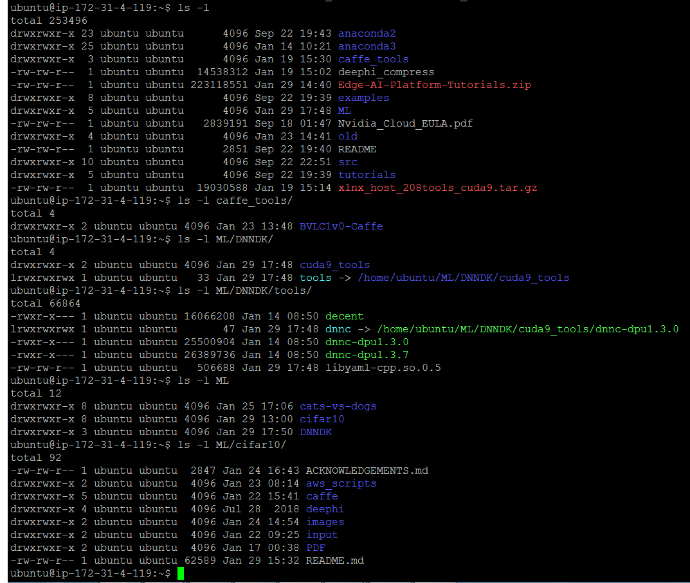
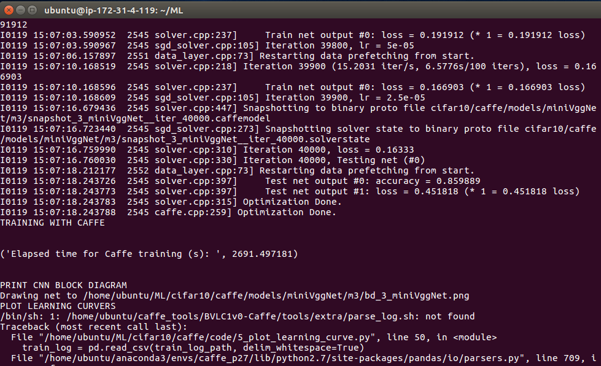
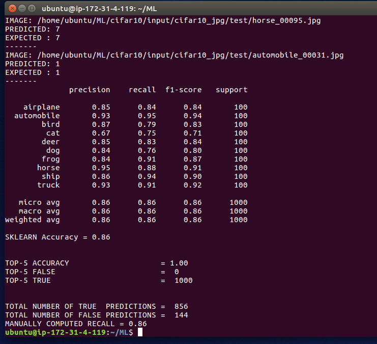
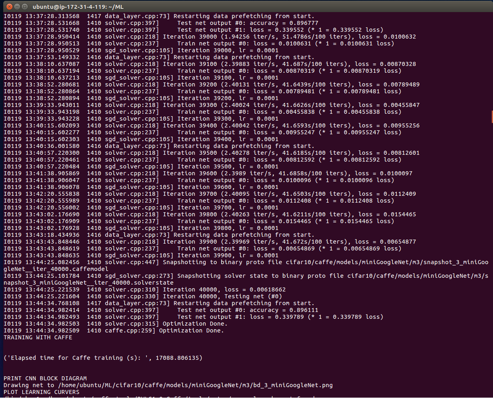
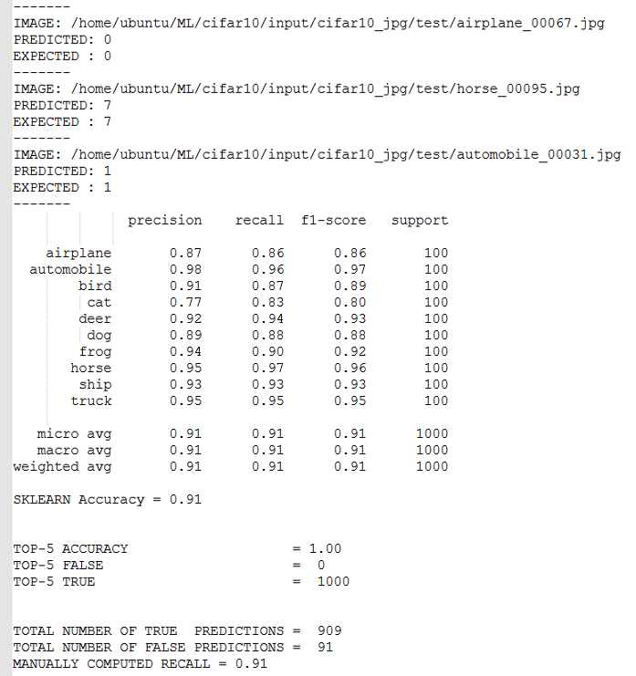

<table>
 <tr>
   <td align="center"><h1>Edge AI Tutorials</h1>
   </td>
 </tr>
 <tr>
 <td align="center"><h3>CIFAR10 Caffe Tutorial (UG1335)</h3>
 </td>
 </tr>
</table>


# 1 Introduction

This tutorial shows you how to train, prune, and quantize a custom convolutional neural network (CNN) with the [CIFAR10](https://www.cs.toronto.edu/~kriz/cifar.html) dataset. You will use the [Caffe](https://github.com/BVLC/caffe) framework and Xilinx® DNNDK tools on a <a href="https://www.xilinx.com/products/boards-and-kits/ek-u1-zcu102-g.html">ZCU102</a> target board.

The CIFAR10 dataset is composed of 10 classes of objects to be classified. It contains 60000 labeled RGB images that are 32x32 in size. The images are organized in three databases:
- ``train_lmdb``: 50000 images in the LMDB database for the forward/backward training process.
- ``valid_lmdb``:  9000 images in the LMDB database for the validation step during the training process.
- ``test``: 1000 images in JPEG plain format for the top-1 prediction measurements after the CNN has been trained.

The last two datasets are created by the 10000 images from the original CIFAR10 testing dataset. All the images are randomly shuffled before forming the database.

MiniVggNet and miniGoogleNet are custom CNNs described in the [Starter Bundle book](https://www.pyimagesearch.com/deep-learning-computer-vision-python-book) by [Dr. Adrian Rosebrock](https://www.linkedin.com/in/adrian-rosebrock-59b8732a/) from [PyImageSearch](https://www.pyimagesearch.com/). They are modeled and trained in Keras/TensorFlow, and have then been manually translated in ``.prototxt`` files and trained from scratch with Caffe.

MiniVggNet has all the features of the original VGG16 CNN, but it is less deep. The CIFAR10 dataset is much smaller than the ImageNet dataset that was used to train the original VGG16 network; the same applies to miniGoogleNet when compared with GoogleNet Inception v1. The way the layers are organized has also been changed, because the Xilinx DPU does not support ReLU before the BatchNorm (BN) layer at the time of writing. The number of BN and DROPOUT layers has also been reduced.

In this tutorial, the flow is only fully described using the miniVggNet example. MiniGoogleNet applies the same procedure, but only the final results are summarized.

Links to reference articles are available in this complementary PDF: [CIFAR10_0_Introduction](PDF/CIFAR10_0_Introduction.pdf).

:pushpin: **Note:** The Xilinx pruning tool requires a license fee and is therefore not included in this tutorial, although all the shell scripts to prune the CNNs and related log files are available [here](deephi/miniVggNet/pruning) for miniVggNet and [here](deephi/miniGoogleNet/pruning) for miniGoogleNet.

:pushpin: **Note:**  The [PDF](PDF/) slides are only for your visual help, they are not frequently updated as the markdown (md) files.

# 2 What You Will Learn

By the end of this tutorial, you will understand how to train a custom CNN in Caffe from zero with the CIFAR10 dataset. You will also learn how to run it in the ZCU102 board after quantization (and optionally pruning) with the Xilinx DNNDK tools. This is accomplished by performing the steps listed below:

1) Use a powerful set of Python scripts to do the following:

    - Create the databases for training, validation, testing, and calibration.
    - Train the CNN using Caffe and generate the ``.caffemodel`` file of floating point weights.
    - Use the trained network to make predictions from images and compute the top-1 accuracy with the ``.caffemodel`` weights file.
    - Plot the learning curves of your training process and the CNN block diagram.


2) Use the Xilinx DNNDK tools to quantize the floating point weights of your original ``.caffemodel`` file (normally called  the _baseline_).

3) Compile and run the application on the ZCU102 target board to measure the effective frame rate.

4) Measure the effective average top-1 accuracy you get during run-time execution on the target board.

5) Optionally, prune the CNN so that there are fewer operations to be computed, thus increasing the effective frame rate achievable. It is possible to do this without detriment to the top-1 accuracy. After pruning, you need to run quantization on the pruned ``.caffemodel`` file before compiling and running the application on the ZCU102 board.

# 3 Prerequisites

This tutorial assumes you are using a PC mounting Ubuntu 16.04 Linux OS with [Python 2.7](https://www.python.org/download/releases/2.7/) and its [virtual environments](https://docs.python-guide.org/dev/virtualenvs), [Caffe BVLC](https://github.com/BVLC/caffe), and [Keras](https://keras.io/) on the TensorFlow backend. The PC must have a CUDA-compatible GPU card and the following libraries: CUDA 8.0 or 9.0, and cuDNN 7.0.5. Alternatively, you can use a p2.xlarge instance of Deep Learning Base AMI Ubuntu version 15 from AWS. Many of the Ubuntu packages required by ML tools are already required by Xilinx [SDx tools](https://www.xilinx.com/support/documentation/sw_manuals/xilinx2018_1/ug1238-sdx-rnil.pdf) as well, so you would have to install them anyway.

After downloading and uncompressing the tutorial archive, ``Edge-AI-Platform-Tutorials.zip``, move the ``docs/ML-CIFAR10-Caffe`` subfolder to the ``$HOME/ML`` directory and rename it to ``cifar10``, using instructions similar to those in the example below:
```
cd $HOME #start from here
unzip Edge-AI-Platform-Tutorials.zip #uncompress
cd Edge-AI-Platform-Tutorials/docs #go to subfolder "docs"
mv ML-CIFAR10-Caffe cifar10 # rename the folder "ML-CIFAR10-Caffe" into "cifar10"
mkdir $HOME/ML #create this directory if it does not exist yet
mv cifar10 $HOME/ML # move the "cifar10" folder below the $HOME/ML folder
```

**:warning: CAUTION:** This project has not been tested outside these conditions. Deviation from these conditions is at your own risk.

## 3.1 Caffe

Download Caffe from the [Caffe GitHub repository](https://github.com/BVLC/caffe). [This page](http://caffe.berkeleyvision.org/installation.html) describes the Caffe installation process. I have my own way to install it (including also how to install the CUDA libraries for compatible GPUs) and I can share if you contact me directly by [email](mailto:daniele.bagni@xilinx.com).

The [CIFAR10_1_Caffe-Background.pdf](PDF/CIFAR10_1_Caffe-Background.pdf) document provides some basic information about the Caffe ML design environment.

The official online Caffe tutorial is available [here](http://caffe.berkeleyvision.org/tutorial/).


## 3.2 Xilinx DNNDK Tools

For this tutorial, use the following release of the DNNDK tools:

- [xlnx_dnndk_v2.08.tar.gz](https://www.xilinx.com/products/design-tools/ai-inference/ai-developer-hub.html#edge)
- [ZCU102img](http://www.deephi.com/assets/2018-12-04-zcu102-desktop-stretch.img.zip)

You can also target alternative boards such as the following:
- [ZCU104img](http://www.deephi.com/assets/2018-12-04-zcu104-desktop-stretch.img.zip)
- [DP8020img](http://deephi.com/assets/2018-12-04-dp-8020-desktop-stretch.img.zip)

The DNNDK User Guide is available here:

- [DNNDK User Guide (UG1327)](https://www.xilinx.com/support/documentation/user_guides/ug1327-dnndk-user-guide.pdf)


If you do use previous releases, you should get the same top-1 accuracy results with a difference of 2-3%. A larger difference implies that something is wrong in the environment.

## 3.3 Docker Image

[Kester Aernoudt](mailto:kestera@xilinx.com) has created an image with the [Docker](https://www.docker.com/) container, you can download it [here](https://cloud.docker.com/u/kesteraernoudt/repository/docker/kesteraernoudt/dnndk_2.08). The image has all the ML tools needed to run this tutorial already pre-installed. This is likely the simplest way for you to get the tools up and running.

:pushpin: **Note:** To use this Docker image, you need to have the [Nvidia Docker Tool](https://github.com/NVIDIA/nvidia-docker) and an NVIDIA GPU card installed.


## 3.4 AWS p2.xlarge Instance

A good reason to use [AWS](https://aws.amazon.com/) is that most of the ML SW tools are already preinstalled on the Deep Learning Base AMI Ubuntu (version 15), shown in the below screenshot. You only need to install Keras on the TensorFlow backend.


If you choose a p2.xlarge EC2 instance, as illustrated in the following screenshot, you get a K80 NVIDIA GPU, which is more than enough to run this tutorial:


### 3.4.1 Installing the Xilinx DNNDK Tools on AWS
Installing the Xilinx DNNDK tools on the AWS is straightforward. You only need to copy the tools there.

1. Uncompress the original ``xlnx_dnndk_v2.08.tar.gz`` archive and place it in a folder named ``~/DNNDK/xlnx_dnndk_v2.08`` on your local PC (Windows or Linux OS; it does not matter).
2. Execute the following commands:
```
cd ~/DNNDK/xlnx_dnndk_v2.08_beta
cd host_x86/pkgs/ubuntu16.04
mkdir cuda9_tools
cp dnnc-dpu* ./cuda9_tools
cp cuda_9.0_cudnn_v7.0.5/decent ./cuda9_tools
tar –cvf xlnx_host_208tools_cuda9.tar ./cuda9_tools
gzip xlnx_host_208tools_cuda9.tar
```
3. Copy the ``xlnx_host_208tools_cuda9.tar.gz`` archive from your local PC to your ``$HOME`` in the AWS p2.xlarge instance. Do the same for the archive ``Edge-AI-Platform-Tutorials.zip``.
4. When both files are there, you can launch the [set_aws_ML_env_cuda9.sh](aws_scripts/set_aws_ML_env_cuda9.sh) script, which creates the system of directories required by this tutorial. To avoid wasting storage space on the AWS, soft links are heavily used. Note also that the script installs Keras on the  ``tensorflow_p27`` environment (which you activate with the command ```source activate tensorflow_p27```). Execute the following commands on your AWS instance:
```
cd $HOME
unzip Edge-AI-Platform-Tutorials.zip
cd Edge-AI-Platform-Tutorials/docs
mv ML-CIFAR10-Caffe cifar10
mv CATSvsDOGS cats-vs-dogs
mkdir $HOME/ML
mv cifar10 $HOME/ML
mv cats-vs-dogs $HOME/ML
cd $HOME
source $HOME/ML/cifar10/aws_scripts/set_aws_ML_env_cuda9.sh
# answer YES to possible questions like "Proceed?"
```

At the end of this process, if you list all the directories newly created, you should see what is reported in the following screenshot:


:pushpin: **Note:** This screenshot also lists the DNNDK pruning tool (``deephi_compress``), which is not included in this tutorial because it requires a license fee.


## 3.5 Important Warning

In Caffe, ``.prototxt`` files cannot use Linux environmental variables; only relative pathnames. This project therefore assumes the following fixed directories:

- ``$HOME/ML/cifar10/caffe`` is the working directory (variable ``$WORK_DIR``).

- ``$CAFFE_ROOT`` is where the Caffe tool is installed.

- ``$HOME/ML/DNNDK/cuda9_tools`` is where the DNNDK ``decent`` and ``dnnc`` tools are placed.

If you use AWS Ubuntu AMI, the [set_aws_ML_env_cuda9.sh](aws_scripts/set_aws_ML_env_cuda9.sh) script creates the directory structure for the whole project, assuming the following values:
  - ``$HOME`` stays for ``/home/ubuntu``.
  - ``$CAFFE_ROOT`` stays for ``/home/ubuntu/src/caffe_python2``.

If you use your own Ubuntu PC instead of the AWS:
- ``$HOME`` is your home directory, shortly ``~`` in Linux (for example, ``/home/danieleb``).
- ``CAFFE_ROOT`` is where you have placed the Caffe tool (for example, ``/home/danieleb/caffe_tools/BVLC1v0-Caffe``).

It is recommended not to deviate from the above structure. The alternative is changing all the pathnames in the shell and Python scripts as well as in the ``.prototxt`` files. This process has a higher risk of error.

Furthermore, to correctly use the pathnames adopted in the ``.prototxt`` files, all the ``*.sh`` shell scripts must be launched from the ``$HOME/ML/`` directory.

Finally, sometimes you might need to pre-process the``*.sh`` shell scripts with the [dos2unix]( http://archive.ubuntu.com/ubuntu/pool/universe/d/dos2unix/dos2unix_6.0.4.orig.tar.gz) utility before executing them.


# 4 Xilinx DNNDK Overview

The installation procedure and flow for the DNNDK tools are described in the [DNNDK User Guide 1327](https://www.xilinx.com/support/documentation/user_guides/ug1327-dnndk-user-guide.pdf).

# 4 DNNDK Overview

The tools are available only in Ubuntu 16.04, not in any other Linux distribution; they are split into two parts, one running on the Ubuntu Linux _host_  PC and another running on the Ubuntu Linux filesystem of the _target_ board (the ZCU102 in this case), which you need to have connected through WLAN and UART cables on your local PC.

:pushpin: **Note:**  The local PC connected to the board does not need to have the Ubuntu 16.04 OS: it could also mount the Windows OS. You only need that PC to communicate with the _target_ board. On the other hand, the _host_ PC must be an Ubuntu 16.04 one, be it either your local PC (mounting Ubuntu OS) or the AWS remote server.

The Xilinx DNNDK tools on the _host_ are not connected with [Vivado® Design Suite](https://www.xilinx.com/products/design-tools/vivado.html), because they are required for pruning and quantization. The three tools in question are ``decent``, ``dnnc``, and ``deephi_compress``. This last one is not included in this tutorial because it requires a license fee, but log files are provided to illustrate how it works.

## 4.1 DNNDK: DPU

The AI inference hardware accelerator running on the ZU9 device of the ZCU102 _target_ board is referred to as the deep processor unit (DPU). The CNN to be launched on the FPGA device has kernels running in software on the Arm™ CPU, and other kernels running in hardware on the DPU itself.

The DPU can be considered as a programmable co-processor of the Arm CPU, where the original CNN has been transformed into an .ELF file, which is in fact the software program for the co-processor. The same DPU architecture can therefore run multiple different types of CNN, each one represented by a different .ELF file.

In summary, the Xilinx DNNDK tools transform the Caffe ``.prototxt`` description and ``.caffemodel`` binary weights files (modeling the CNN understudy) into .ELF files running on the CPU/DPU embedded system.

## 4.2 DNNDK: Quantization

The key steps of the quantization flow are as follows:

1.	The ``decent`` tool does the quantization. It needs two input files, namely ``float.prototxt``  and ``float.caffemodel``. The first file is the ``.prototxt`` text description of the CNN layers, and the second file is the 32-bit floating point of the weights you get after training your CNN with Caffe and the database of images. The ``decent`` tool generates two output files, ``deploy.prototxt`` and ``deploy.caffemodel``, which are then input to the ``dnnc`` compiler. What ``decent`` does is more or less independent of the DPU hardware architecture; this is why it runs on the _host_ PC.

2. The ``dnnc`` tool takes those two output files and analyzes them to see if there are inconsistencies or layers not supported by the architecture of the Xilinx DPU accelerator IP core. It then generates either .ELF files or error messages. It can also merge and fuse layers together to optimize the implementation.

3.	When this is done, your work on the _host_ PC is finished and you can move to the _target_ board. Assuming that you have transferred the .ELF files generated in the step above using ``ssh/scp``, you now use the tools on the _target_ board to compile the C++ application which uses the DPU hardware accelerator. Open a terminal (using [PuTTY](https://www.putty.org/) or [Tera Term](https://download.cnet.com/Tera-Term/3000-2094_4-75766675.html)) on the ZCU102 board and compile the application there. The application is a hybrid containing part of the application running on the Arm CPU (SoftMax and top-k accuracies, plus the loading of the input .mp4 movie or the images) and part of the application running on the DPU (the convolutional layers and so on).

## 4.3 DNNDK: Pruning


The ``deephi_compress`` tool performs pruning, which is an optional process. You are not obliged to prune your CNN; an unpruned CNN is referred to as a baseline CNN. If you do prune it, you must iteratively apply the same training process through which you got the original ``float.prototxt``  and ``float.caffemodel`` files.

Pruning is solely an optimization technique and does not affect the hardware architecture of the DPU. In the case of miniVggNet in this tutorial, the number of parameters of the original CNN is ~2M, but after pruning it is only ~70000. The pruned CNN is less heavy and therefore performs with a higher frame rate on the architecture of the DPU IP core, because the core has fewer operations to compute.

At the end of the pruning process, you get a new set of ``float.prototxt`` and ``float.caffemodel`` files that now require far fewer operations to be completed (in other words, the CNN has been compressed). Repeat the quantization steps (1-3) described above to launch your pruned CNN on the CPU/DPU of the ZC102 board.


# 5 Project Directory Structure

The ``cifar10`` project is organized in the following subdirectories (placed under ``$HOME/ML/cifar10``):
- ``caffe/code`` contains all the Python2.7 scripts.

- ``caffe/models`` contains the solver, training, and deploy``.prototxt`` files for miniVggNet and other CNNs.

- ``caffe/rpt`` contains log files captured for your reference.

- ``deephi`` contains the files for quantization of either the baseline (``quantiz``) or pruned (``pruning``) CNN, plus the files for ZCU102 run-time execution (``zcu102/baseline``, ``zcu102/pruned``, and ``zcu102/test_images`` respectively).

- ``input`` contains the following:
  - [LMDB](https://en.wikipedia.org/wiki/Lightning_Memory-Mapped_Database) databases for the Caffe phases of training and validation.
  - JPEG images for testing the top-1 accuracy.
  - Other JPEG images for DNNDK calibration during the quantization process.

# 6 Python Scripts

The Python scripts that compose the ML design flow in Caffe are listed in order of execution below. They enable you to create the datasets, train your CNN with a training and validation LMDB database, and finally make predictions on JPEG images.

1) [1_write_cifar10_images.py](caffe/code/1_write_cifar10_images.py): This script downloads the dataset from the ``keras.datasets`` module and stores it in JPEG format in the ``input/cifar10_jpg`` folder, with subfolders ``test``, ``train``, ``val`` and ``calib``. The ``calib`` folder is needed only for quantization with Xilinx DNNDK. This is the only script which requires Keras in this project, and you only need to execute it once.

2) [2a_create_lmdb.py](caffe/code/2a_create_lmdb.py): This script creates the LMDB databases ``input/lmdb/train_lmdb`` and ``input/lmdb/valid_lmdb`` for the training step. You only need to execute it once.

3) [2b_compute_mean.py](caffe/code/2b_compute_mean.py): This script computes the mean values for the ``train_lmdb`` database in ``input/mean.binaryproto``. You only need to execute it once.  

    :pushpin: **Important:** You cannot run this python script on the AWS (they have not compiled Caffe with OpenCV), therefore you have to comment it out from the [aws_caffe_flow_miniVggNet.sh](caffe/aws_caffe_flow_miniVggNet.sh) and [aws_caffe_flow_miniGoogleNet.sh](caffe/aws_caffe_flow_miniGoogleNet.sh) scripts. It is recommended to add the three mean values (125, 123, and 114 respectively) directly into the ``.prototxt`` model file. Furthermore, the DNNDK ``dnnc`` tool does not support reading the ``input/mean.binaryproto`` file.  

4) [3_read_lmdb.py](caffe/code/3_read_lmdb.py): This script can be used to debug the first two scripts.

5) [4_training.py](caffe/code/4_training.py): This script launches the real training process in Caffe, given certain ``solver`` and CNN description ``.prototxt`` files. To be used for any trial of training.

6) [5_plot_learning_curve.py](caffe/code/5_plot_learning_curve.py) and  [plot_training_log.py](caffe/code/plot_training_log.py): These scripts are to be launched at the end of the training to plot the learning curves of accuracy and loss in different ways.

7) [6_make_predictions.py](caffe/code/6_make_predictions.py): This script is launched at the end of the training to measure the prediction accuracy achieved by the CNN you have trained. You need to have the ``scikit`` (classic ML) library installed.

Another script, [check_dpu_runtime_accuracy.py](caffe/code/check_dpu_runtime_accuracy.py), is also available, but this script is not part of the Caffe design flow. It should be launched only when the CNN is running on the ZCU102 board, to compute the effective top-1 accuracy of the DPU at run time. Doing this allows you to make a fair comparison between the top-1 accuracy values when simulated by the ``.caffemodel`` in Caffe on the _host_ PC, when estimated by DNNDK ``decent`` on the _host_ PC, and when measured at run time on the _target_ ZCU102 board.

If you are working on a local Ubuntu PC and have both Caffe and Keras in the same Python [virtual environment](https://docs.python-guide.org/dev/virtualenvs), all the Python scripts can be orchestrated in the [caffe_flow_miniVggNet.sh](caffe/caffe_flow_miniVggNet.sh) shell script. Normally, the first four scripts can be commented out after you have executed them the first time. The commands to be launched are similar to those in the example below:
```
cd $HOME/ML
source cifar10/caffe/caffe_flow_miniVggNet.sh 2>&1 | tee cifar10/caffe/models/miniVggNet/m3/logfile_3_miniVggNet.txt
```
If you are working on the AWS, the shell script needs some changes due to the different environment. Apply the [aws_caffe_flow_miniVggNet.sh](caffe/aws_caffe_flow_miniVggNet.sh) script instead, with similar commands:
```
cd $HOME/ML
source cifar10/caffe/aws_caffe_flow_miniVggNet.sh 2>&1 | tee cifar10/caffe/models/miniVggNet/m3/aws_logfile_3_miniVggNet.txt
```

**:warning: Warning:** Relative pathnames are used in the ``.prototxt`` files. Do not launch the scripts in a directory different from ``$HOME/ML``, or they will fail.

:pushpin: **Note:** In a Linux shell, you can comment out a set of lines by surrounding them with the following symbols: ``: '``  before the first line to be commented and `` ' `` after the last line to be commented.


# 7 MiniVggNet Caffe .prototxt Files

## 7.1 CNN Model Description
To describe the CNN in Caffe, you need a ``.prototxt`` text file which shows the type of layers and how they are connected, plus some specific features to be activated only during the training or validation phases, indicated as TRAIN and TEST respectively. You also need to set the ``batch_size`` during the TRAIN and TEST phases (128 and 50 respectively): this last number is given by the number  of validation images (9000)  and ``test_iter`` (180). During the TRAIN phase, all the parameters of the CNN are updated with Stochastic Gradient Descend (``SGD``), every ``batch_size`` number of images.

The model giving the best top-1 prediction results in previous experiments is [train_val_3_miniVggNet.prototxt](caffe/models/miniVggNet/m3/train_val_3_miniVggNet.prototxt). Associated with it, you also have the [deploy_3_miniVggNet.prototxt](caffe/models/miniVggNet/m3/deploy_3_miniVggNet.prototxt), which is needed to compute the prediction accuracy on the 1000 images in the TEST subfolder (the same that will be used at run time on the ZCU102).

There is another model, [deephi_train_val_3_miniVggNet.prototxt](caffe/models/miniVggNet/m3/deephi_train_val_3_miniVggNet.prototxt), which is applied during the quantization process of the baseline CNN. It is exactly the same as [train_val_3_miniVggNet.prototxt](caffe/models/miniVggNet/m3/train_val_3_miniVggNet.prototxt), but the LMDB database of the TRAIN phase has been replaced by the calibration images, and top-5 accuracy layer is added at the bottom of the CNN description.


## 7.2 Caffe Training Process Solver

In Caffe, the solver file defines the optimization method (that is, ``SGD``, or ``Adam``, or ``Nesterov``), the number of iterations, and the policy for changing the learning rate during the various iterations. It also says if a CPU or GPU is being used for computation.

The solver file is named [solver_3_miniVggNet.prototxt](caffe/models/miniVggNet/m3/solver_3_miniVggNet.prototxt), and contains the settings for the training of miniVggNet model that have proved to be optimal. 40000 iterations were used here, but results are relatively stable after only 20000 iterations.

## 7.3 Output Results

Saved post-training output results are placed in the [rpt](caffe/models/miniVggNet/m3/rpt) subfolder for your reference. They include the following:


- PNG image files containing the [block diagram](caffe/models/miniVggNet/m3/rpt/bd_3_miniVggNet.png) of the CNN and how the [learning curves](caffe/models/miniVggNet/m3/rpt/plt_train_val_3_miniVggNet.png) change during the training process.
- The [log file](caffe/models/miniVggNet/m3/rpt/logfile_3_miniVggNet.log) of the Caffe proper training process from which all the above .PNG files are generated.
- The [log file](caffe/models/miniVggNet/m3/rpt/predictions_3_miniVggNet.txt) of the top-1 predictions computed on the 1000 images of the testing dataset.

The following screenshot illustrates the end of the training on the AWS. Note the ~86% top-1 average accuracy computed on the validation dataset.


The following screenshot shows the predictions on the 1000 test images. Note the ~87% top-1 average accuracy.


## 7.4 Performance

After training is executed, the top-1 prediction accuracy is 87% on average. Top-1 values from 84% to 88% are allowed: GPUs have varying random states, and you might not achieve exactly the same numerical results.  

See below the elapsed time for the training in Caffe with 40000 iterations on different NVIDIA GPU cards with a different configuration memory in GB:
```
Elapsed time on GPU P6000    @24GB: 13min
Elapsed time on GPU Tesla K80@12GB: 45min
Elapsed time on GPU GTX1080  @ 8GB: 48min
Elapsed time on GPU K1000M   @ 2GB:975min
```


# 8 Quantization of the Baseline miniVggNet


You do not need to be in a Python virtual environment to launch the quantization process. Ensure only that you have the tools in your ``PATH`` and ``LD_LIBRARY_PATH`` environmental variables. To this purpose,  if you are in your AWS AMI, you can launch the [aws_activate_dnndk_cuda9.sh](aws_scripts/aws_activate_dnndk_cuda9.sh) script:
```
source ~/ML/cifar10/aws_scripts/aws_activate_dnndk_cuda9.sh
```

## 8.1 Input and Output .prototxt Files

The ``decent`` tool needs the following inputs:
- ``float.prototxt``: This is the description text file of the floating point CNN model.
- ``float.caffemodel``: This is the file with pre-training weights of the CNN in floating point.
- ``calibration dataset``: This is a subset of the images used in the original training, containing about 1000 pictures in this case study.

When the quantization is done, two output files are generated. These become the inputs to the ``dnnc`` compiler:
- ``deploy.prototxt``: This is the new description text file of the quantized CNN model.
- ``deploy.caffemodel``: This is the file with fixed point quantized weights (this is not a standard Caffe format).

## 8.2 Prepare the Input Files

Preparing the input ``.prototxt`` files requires the following steps.

1) Take the weights file generated after the Caffe training process (``snapshot_3_miniVggNet__iter_40000.caffemodel``), and rename it to ``float.caffemodel``.

2) Take the description file used in the Caffe training process ([train_val_3_miniVggNet.prototxt](caffe/models/miniVggNet/m3/train_val_3_miniVggNet.prototxt)), and rename it to ``float.prototxt``.

3) Make the following further changes to the ``float.prototxt`` file:
- Remove the ``Datatype`` layers for the original TRAIN phase.
- Add an ``ImageData`` type layer with the calibration images for the new TRAIN phase.
- On the bottom, add two ``Accuracy`` type layers to compute top-1 and top-5 accuracies.
- Remove the mean file and put separate values (the DPU does not support reading a binary mean file).

For your reference, the changes detailed in step 3 have already been made in  [deephi_train_val_3_miniVggNet.prototxt](caffe/models/miniVggNet/m3/deephi_train_val_3_miniVggNet.prototxt), while steps 1 and 2 are already done in the [decent_miniVggNet.sh](deephi/miniVggNet/quantiz/decent_miniVggNet.sh) shell script.


## 8.3 Five-Step Quantization Flow

1. Compress the neural network model (from the  _host_ side) using  ``decent``.
2. Compile the neural network model (from the _host_ side) using  ``dnnc``. See below for a command line example for the miniVggNet case (using the [decent_miniVggNet.sh](deephi/miniVggNet/quantiz/decent_miniVggNet.sh) and [dnnc_miniVggNet.sh](deephi/miniVggNet/quantiz/dnnc_miniVggNet.sh) scripts):
   ```
   cd ~/ML
   source cifar10/deephi/miniVggNet/quantiz/decent_miniVggNet.sh 2>&1 | tee cifar10/deephi/miniVggNet/quantiz/rpt/logfile_decent_miniVggNet.txt
   source cifar10/deephi/miniVggNet/quantiz/dnnc_miniVggNet.sh   2>&1 | tee cifar10/deephi/miniVggNet/quantiz/rpt/logfile_dnnc_miniVggNet.txt
    ```    

3. Edit the [main.cc](deephi/miniVggNet/zcu102/baseline/src/top5_main.cc) program application (from the _host_ side).

4. Compile the hybrid application (from the _target_ side) with the ``make`` utility.

5. Run the hybrid application (from the _target_ side). See below for a command line example for the miniVggNet case:
   ```
   cd /root/cifar10/miniVggNet/zcu102/baseline
   make clean
   source run_fps_miniVggNet.sh  2>&1 | tee ./rpt/logfile_fps_miniVggNet.txt
   source run_top5_miniVggNet.sh 2>&1 | tee ./rpt/logfile_top5_miniVggNet.txt
   ```

You can now copy (``ssh/scp``) the [logfile_top5_miniVggNet.txt](deephi/miniVggNet/zcu102/baseline/rpt/logfile_top5_miniVggNet.txt) from the _target_ board to your _host_ PC and run the latest Python script ([check_dpu_runtime_accuracy.py](caffe/code/check_dpu_runtime_accuracy.py)) to check the top-1 accuracy delivered by the DPU on the test images at run time (or vice versa you copy the python script on the _target_ board and run it there) . This is the most important step, because you can now see the real average accuracy of your CNN system working at run time.

The estimated top-1 average accuracy after quantization can be seen in one of the last lines of the captured [decent log file](deephi/miniVggNet/quantiz/rpt/aws_logfile_decent_miniVggNet.txt). A remarkable (for this small CNN) ~86% is achieved.

In step 2, ``dnnc`` says that there is one kernel task running on the DPU (implementing the CONV, ReLU, BN, and FC layers) and another kernel running in software on the Arm CPU of ZCU102  (for the top-k and SoftMax layers). You can see this in the captured [dnnc log file](deephi/miniVggNet/quantiz/rpt/aws_logfile_dnnc_miniVggNet.txt).

## 8.4  Main  Application

The variants only differ in a few ``printf`` lines, which are used in the first file but commented out in the second file. They print the top-5 accuracies for each input image to be classified, as seen in the example below:
```
// from void TopK(const float *d, int size, int k, vector<string> &vkind) {
// ...
      pair<float, int> ki = q.top();
      printf("[Top]%d prob = %-8f  name = %s\n", i, d[ki.second], vkind[ki.second].c_str());
// ...

// from void classifyEntry(DPUKernel *kernelconv){
// ...
	    cout << "DBG imread " << baseImagePath + images.at(ind) << endl;
// ...
```

If you change the way this information is printed in the ``stdout``, you must also change the Python script [check_dpu_runtime_accuracy.py](caffe/code/check_dpu_runtime_accuracy.py) accordingly, because it acts essentially as a text parser of the [top-5 log file](deephi/miniVggNet/zcu102/baseline/rpt/logfile_top5_miniVggNet.txt) captured at run time.

Also in the first lines of the [top5_main.cc](deephi/miniVggNet/zcu102/baseline/src/top5_main.cc) file, you need to report the kernel name, input node, and output node that were generated by the ``dnnc`` compiler in the [log file](deephi/miniVggNet/quantiz/rpt/logfile_dnnc_miniVggNet.txt):
```
#define KERNEL_CONV "miniVggNet_0"
#define CONV_INPUT_NODE "conv1"
#define CONV_OUTPUT_NODE "fc2"
```

## 8.5 DNNDK APIs

The three routines in [top5_main.cc](deephi/miniVggNet/zcu102/baseline/src/top5_main.cc) that make use of DPU APIs are ``main()``, ``classifyEntry()`` and ``run_miniVggNet()``. These routines are described below:
- ``main()`` opens the DPU device, loads the convolutional kernel, and finally destroys and closes it when the classification routine is terminated just before the return command.
- ``classifyEntry()`` is the classification routine. It creates a task on the DPU for the convolutional kernel it has to run (in general, one task for each separate kernel you might have). It does this in a multi-threading way, where the number of parallel threads is an argument you have to pass to the executable running on the Arm CPU using ``argc/argv``.
- ``run_miniVggNet()`` does most of the work, as shown in the following code snippet:
```
void run_miniVggNet(DPUTask *taskConv, Mat img) {
    assert(taskConv );

    int channel = dpuGetOutputTensorChannel(taskConv, CONV_OUTPUT_NODE);
    float *softmax = new float[channel];
    float *FCResult = new float[channel];
    _T(dpuSetInputImage2(taskConv, CONV_INPUT_NODE, img));

    _T(dpuRunTask(taskConv));

    _T(dpuGetOutputTensorInHWCFP32(taskConv, CONV_OUTPUT_NODE, FCResult, channel));
    _T(CPUCalcSoftmax(FCResult, channel, softmax));
    _T(TopK(softmax, channel, 5, kinds));

    delete[] softmax;
    delete[] FCResult;
}
```

## 8.6 Before Executing on ZCU102

To compile and run the application on ZCU102, you need to archive the entire contents of the ``cifar10/deephi/miniVggNet/zcu102/baseline`` folder into a ``.tar`` file and copy it (``ssh/scp``) from the _host_ PC to the _target_ board. Make sure to physically copy the 1000 images from the testing folder ``cifar10/input/cifar10_jpg/test/`` to the ``cifar10/deephi/miniVggNet/zcu102/test_images`` local subdirectory.

The following as a list of the commands you could launch from the _target_ (static IP address 192.168.1.101) to the _host_ (static IP address 192.168.1.100). These examples assume that your current folder is ``cifar10/deephi/miniVggNet/zcu102/`` in the _host_ PC and you have a folder named ``/root/cifar10/miniVggNet/zcu102`` in the file system of the SD card on the _target_ ZCU102 board:
```
(from host)
cd ~/ML/cifar10/deephi/miniVggNet/zcu102/
cp -r ../../../input/cifar10_jpg/test ./test_images
tar -cvf baseline.tar ./baseline ./test_images
scp baseline.tar root@192.168.1.100:/root/cifar10/miniVggNet/zcu102/

(from target)
cd /root/cifar10/miniVggNet/zcu102
tar -xvf baseline.tar
cd ./baseline
make clean
source run_fps_miniVggNet.sh  2>&1 | tee ./rpt/logfile_fps_miniVggNet.txt
source run_top5_miniVggNet.sh 2>&1 | tee ./rpt/logfile_top5_miniVggNet.txt

(from host)
cd ~/ML/cifar10/deephi/zcu102/baseline/rpt
scp root@192.168.1.100:/root/cifar10/miniVggNet/zcu102/baseline/rpt/logfile_top5_miniVggNet.txt .
python ~/ML/cifar10/caffe/codecheck_dpu_runtime_accuracy.py \
   -i ./logfile_top5_miniVggNet.txt 2>&1 | tee ./logfile_check_dpu_top5_miniVggNet.txt
   ```

## 8.7  Performance of the Quantized Baseline miniVggNet on ZCU102

At the end of this quantization procedure, when the DPU runs the miniVggNet CNN on the ZCU102, the following performance was reported:

- 3710 fps with three threads, as shown in the [logfile_fps_miniVggNet.txt](deephi/miniVggNet/zcu102/baseline/rpt/logfile_fps_miniVggNet.txt) log file.
- ~86% average top-1 accuracy, as shown in the [logfile_check_dpu_top5_miniVggNet](deephi/miniVggNet/zcu102/baseline/rpt/logfile_check_dpu_top5_miniVggNet.txt) log file.


# 9 Pruning the MiniVggNet CNN

## 9.1 Introduction

Pruning is a technique to remove redundant or less useful weights and output channels from a CNN layer to reduce or compress the overall number of operations. The aim is to reduce the number of operations and increase the frames per second (you might not need pruning if you CNN was optimized by design). This can however be detrimental to the average top-1 accuracy: the final result is ultimately a trade-off between the desired compression and the effective accuracy to sustain a certain target frame rate.

### 9.1.1 Fine and Coarse Pruning

There are usually two types of pruning: fine and coarse. Fine pruning selectively kills either the weights or the output features with the smallest values from a channel. To achieve higher frame rates from a fine-compressed CNN, the hardware accelerator must be enabled to perform zero-skipping (that is, skipping all the multiplications with zero values). Zero-skipping requires a proper hardware architecture and organization of non-zero data (usually with [run-length coding](https://en.wikipedia.org/wiki/Run-length_encoding)) in the internal memory of the hardware accelerator; otherwise, there would be no performance gain from fine pruning.

Xilinx DNNDK applies coarse pruning, which involves removing a complete output channel. In this case, any hardware accelerator can gain from it (not only the DPU, but also the xDNN IP core adopted in the [Xilinx ML Suite](https://github.com/Xilinx/ml-suite)), even if it does not implement zero-skipping in its architecture.

### 9.1.2 Results of Pruning

However, this invasive kind of pruning can affect the average accuracy. It is therefore important to apply the pruning in an iterative manner: for example, by compressing the CNN by only 10% and then performing fine-tuning (which can be a complete training process) to recover the probable accuracy drop. If you work carefully and apply this process for 7-8 steps, you can arrive at 70-80% of compression with a negligible top-1 average accuracy decrease. This iterative process can take a lot of time, especially if you are using a large database.

At the end of the pruning process, you get a new  floating point ``.caffemodel`` file of a size probably reduced by 40-60% (depending on the CNN) in comparison with the original ``.caffemodel`` file of the baseline (non-pruned) CNN. To run it on the ZCU102 board, you need to apply quantization using the output files generated by pruning (with some minor but important manual editing) as the input file to quantization.


## 9.2 Prepare the Input Files for Pruning

Before you begin, you need to have the following files in the ``deephi/miniVggNet/pruning`` working directory:

- [config.prototxt](deephi/miniVggNet/pruning/config.prototxt): Use this file to set the number of GPU devices and test iterations, as well as the Caffe model description, weights files, and compression ratio you want to achieve. In reality, I use seven files like this, and each one applies the weights generated by the previous pruning trial to increment the compression by 10%.
- [solver.prototxt](deephi/miniVggNet/pruning/solver.prototxt): This is the same solver of your original ``.caffemodel``, but renamed (for example, the same [solver_3_miniVggNet.prototxt](caffe/models/miniVggNet/m3/solver_3_miniVggNet.prototxt) was already adopted during the training process).

:pushpin: **Note:** Regarding the solver, in previous experiments, the miniVggNet CNN has been retrained using only 20000 of the original 40000 iterations. Doing this is up to you, but for this CNN, using 20000 rather than 40000 iterations did not have a dramatic effect on top-1 accuracy, and it saved half the PC processing time.

- [train_val.prototxt](deephi/miniVggNet/pruning/train_val.prototxt): This is the same description file of your original ``.caffemodel``, but renamed. For example, it is the same as the [train_val_3_miniVggNet.prototxt](caffe/models/miniVggNet/m3/train_val_3_miniVggNet.prototxt).

:pushpin: **Note:** You need to edit [train_val.prototxt](deephi/miniVggNet/pruning/train_val.prototxt) to add top-1 and top-5 accuracy layers at its end.

- ``float.caffemodel``. This is the same weights file of your original ``.caffemodel``, only renamed (for example, the same ``snapshot_3_miniVggNet__iter_40000.caffemodel``).


## 9.3 Pruning Flow

:pushpin: **Note:** This pruning step is optional. You can skip it if you do not have the Xilinx pruning tool, or if the network does not need pruning.

In previous experiments, pruning the miniVggNet required seven steps of 10% compression each time. The flow can be explained by looking at the [pruning_flow.sh](deephi/miniVggNet/pruning/pruning_flow.sh) shell script:

- ``analysis (ana)`` has to be executed only once at the beginning, and generates a hidden text file, ``.ana.regular``, that is then reused by all following trials. This process can take a lot of time, so it is recommended to comment out the related line in the shell script after you have executed it once (assuming you are not changing the input files).

- Seven steps  of ``compress / finetune`` actions, each one compressing the previously compressed CNN by 10%. In particular, ``compress`` is responsible for heuristically selecting the channels to kill, while ``finetune`` performs a retrain to restore the top-1 accuracy at the previous value if possible.   

- The final action is ``transform``, which transforms the intermediate sparsed model into the effective output ``.caffemodel`` of the compressed CNN (``transform.caffemodel``).

In the ``transform`` step, you need to complete the following steps:
1) Take the same [train_val.prototxt](deephi/miniVggNet/pruning/train_val.prototxt) and not the [final.prototxt](deephi/miniVggNet/pruning/regular_rate_0.7/final.prototxt) generated by the seventh step of ``compress-finetune``.
2) Take the latest snapshot ``.caffemodel`` named ``regular_rate_0.7/snapshots/_iter_20000.caffemodel`` and not the sparse ``.caffemodel`` named ``regular_rate_0.7/sparse.caffemodel``. This is also illustrated in the [pruning_flow.sh](deephi/miniVggNet/pruning/pruning_flow.sh) shell script.


The command to prune the whole CNN is as follows:
```
cd ~/ML/
source cifar10/deephi/miniVggNet/pruning/pruning_flow.sh 2&>1 | tee cifar10/deephi/miniVggNet/pruning/rpt/logfile_whole_pruning_flow.txt
```

**:warning: IMPORTANT:** Change the pathnames inside the ``solver``, ``train_val``, and ``config*.prototxt`` files mentioned above.

## 9.4 Pruning Process Outputs

After seven rounds of ``compress`` and ``finetune`` with half the iterations (20000) of the original Caffe training (40000) two output files are generated from the three input files (``float.caffemodel``,  [solver.prototxt](deephi/miniVggNet/pruning/solver.prototxt), and [train_val.prototxt](deephi/miniVggNet/pruning/train_val.prototxt)). The output files are ``transformed.caffemodel`` and  [final.prototxt](deephi/miniVggNet/pruning/regular_rate_0.7/final.prototxt). These become the input files to the next quantization process.

The compressed miniVggNet now has the following:
- ~69% less operations and ~67% less weights than the original baseline CNN.
- An drop in accuracy from ~87% (baseline) to ~72% (compressed), as reported in the [logfile_compress7_miniVggNet.txt](deephi/miniVggNet/pruning/rpt/logfile_compress7_miniVggNet.txt) log file after the seventh round of compression.

After ``finetune``, the top-1 average prediction accuracy is restored to ~85%, as reported in the  [logfile_finetune7_miniVggNet.txt](deephi/miniVggNet/pruning/rpt/logfile_finetune7_miniVggNet.txt) log file. In both cases, the top-1 accuracy is measured on the validation dataset during the ``finetune`` training process. To measure the effective top-1 average accuracy at run time with the [check_dpu_runtime_accuracy.py](caffe/code/check_dpu_runtime_accuracy.py) Python script, you need to quantize the CNN you just pruned.

The log files of each step are stored in the [rpt](deephi/miniVggNet/pruning/rpt/) folder for your reference. In particular, [logfile_pruning_flow.txt](deephi/miniVggNet/pruning/rpt/logfile_pruning_flow.txt) and [aws_logfile_pruning_flow.txt](deephi/miniVggNet/pruning/rpt/aws_logfile_pruning_flow.txt) are the log files of the whole pruning process running on a personal Ubuntu PC and on a AWS p2.xlarge EC2 instance respectively.

# 10 Quantization of the Pruned miniVggNet

## 10.1 Pruned Quantization Flow

The process is exactly the same at that explained in [Quantization of the Baseline miniVggNet](README.md#8-quantization-of-the-baseline-miniVggNet) section. The only difference is that the input files are now named as follows:

- ``transformed.caffemodel``: The output of the ``transform`` step from the pruning process.
- ``q_final.prototxt``: Generated by manually editing the same [final.prototxt](deephi/miniVggNet/pruning/regular_rate_0.7/final.prototxt) that was produced at the end of the pruning process.

You also need to replace the training LMDB database with the calibration images, and add the three mean values. Pruning is not a deterministic process, so every pruning trial can create a different ``final.prototxt`` file, and in that case you have to re-edit a new ``q_final.prototxt`` file (the [q_final.prototxt](deephi/miniVggNet/pruning/quantiz/rpt/q_final.prototxt) file placed in the [rpt](deephi/miniVggNet/pruning/quantiz/rpt/) folder is solely for documentation).

To compile with the ``decent`` and ``dnnc`` tools, call the two shell scripts, [decent_pruned_miniVggNet.sh](deephi/miniVggNet/pruning/quantiz/decent_pruned_miniVggNet.sh) and [dnnc_pruned_miniVggNet.sh](deephi/miniVggNet/pruning/quantiz/dnnc_pruned_miniVggNet.sh), with the following commands:
```
cd ~/ML
source /cifar10/deephi/miniVggNet/pruning/quantiz/decent_pruned_miniVggNet.sh 2>&1 | tee /cifar10/deephi/miniVggNet/pruning/quantiz/rpt/logfile_decent_pruned_miniVggNet.txt
source /cifar10/deephi/miniVggNet/pruning/quantiz/dnnc_pruned_miniVggNet.sh   2>&1 | tee /cifar10/deephi/miniVggNet/pruning/quantiz/rpt/logfile_dnnc_pruned_miniVggNet.txt
```

## 10.2 Before Executing on ZCU102

To compile and run the application on ZCU102, you need to archive the entire contents of the ``cifar10/deephi/miniVggNet/zcu102/pruned`` folder into a ``.tar`` file, and copy it (``ssh/scp``) from the _host_ PC to the _target_ board. Make sure to physically copy the 1000 images from the testing folder, ``cifar10/input/cifar10_jpg/test/``, to the ``cifar10/deephi/miniVggNet/zcu102/test_images`` local subdirectory.

See below for a list of example commands you can launch from the _target_ (static IP address 192.168.1.101) to the _host_ (static IP address 192.168.1.100), assuming your current folder is ``cifar10/deephi/miniVggNet/zcu102/`` in the _host_ PC and you have a folder named ``/root/cifar10/miniVggNet/zcu102`` in the file system of the SD card of the _target_ ZCU102 board:

```(from host)
cd ~/ML/cifar10/deephi/miniVggNet/zcu102/
cp -r ../../../input/cifar10_jpg/test ./test_images
tar -cvf pruned.tar ./pruned ./test_images
scp pruned.tar root@192.168.1.100:/root/cifar10/miniVggNet/zcu102/

(from target)
cd /root/cifar10/miniVggNet/zcu102
tar -xvf pruned.tar
cd ./pruned
make clean
source run_fps_miniVggNet.sh  2>&1 | tee ./rpt/logfile_fps_pruned_miniVggNet.txt
source run_top5_miniVggNet.sh 2>&1 | tee ./rpt/logfile_top5_pruned_miniVggNet.txt

(from host)
cd ~/ML/cifar10/deephi/zcu102/pruned/rpt
scp root@192.168.1.100:/root/cifar10/miniVggNet/zcu102/pruned/rpt/logfile_top5_pruned_miniVggNet.txt .
python ~/ML/cifar10/caffe/codecheck_dpu_runtime_accuracy.py \
   -i ./logfile_top5_pruned_miniVggNet.txt 2>&1 | tee ./logfile_check_dpu_top5_pruned_miniVggNet.txt
   ```

## 10.3 Performance of the Quantized Pruned miniVggNet on ZCU102

At the end of the pruning and quantization procedures, when the DPU runs the miniVggNet CNN on the ZCU102, the following performance was reported:
- 4895 fps with six threads, as shown in the [logfile_fps_miniVggNet.txt](deephi/miniVggNet/zcu102/pruned/rpt/logfile_fps_pruned_miniVggNet.txt) log file.
- 85% average top-1 accuracy, as shown in the [logfile_check_dpu_top5_pruned_miniVggNet](deephi/miniVggNet/zcu102/pruned/rpt/logfile_check_dpu_top5_pruned_miniVggNet.txt) log file.


# 11 MiniVggNet Summary

## 11.1 Summary of the miniVggNet Design Flow

Congratulations! You have completed the Caffe training of miniVggNet using the CIFAR10 database. You then applied Xilinx DNNDK to quantize the original CNN to get a baseline reference. You also have seen how to prune (and quantize again) the new optimized CNN: the CNN is optimized in the sense that it has fewer output channels than its baseline version.

By running the .ELF files of either the baseline or the pruned CNNs on the ZCU102 target board, you have measured a frame rate improvement from 3710 fps (baseline) to 4895 fps (pruned) with a small drop in average top-1 accuracy, from 86% in the baseline to 85% in the pruned CNN.
See below for a summary of the most important steps you have completed to arrive at this point.

1) You have downloaded the CIFAR10 dataset and organized it in the proper way to train miniVggNet with Caffe, making predictions on 1000 testing images to get the average top-1 accuracy: 50000 and 9000 images respectively in the LMDB training and validation databases, plus 1000 images (from the training dataset) to compose the calibration dataset to be used during the quantization process. You have applied the following Python scripts:
    - [1_write_cifar10_images.py](caffe/code/1_write_cifar10_images.py)
    - [2a_create_lmdb.py](caffe/code/2a_create_lmdb.py)
    - [2b_compute_mean.py](caffe/code/2b_compute_mean.py)

2) You have trained the CNN with 40000 iterations by applying the [4_training.py](caffe/code/4_training.py) Python script  and the  [train_val_3_miniVggNet.prototxt](caffe/models/miniVggNet/m3/train_val_3_miniVggNet.prototxt) and [solver_3_miniVggNet.prototxt](caffe/models/miniVggNet/m3/solver_3_miniVggNet.prototxt) input ``.prototxt`` files. You have also plotted the learning curves of the training process with the [5_plot_learning_curve.py](caffe/code/5_plot_learning_curve.py) Python script.

3) The floating point weights file ``float.caffemodel`` generated in the previous step together with the CNN deploy model ([deploy_3_miniVggNet.prototxt](caffe/models/miniVggNet/m3/deploy_3_miniVggNet.prototxt)) have then been used to make predictions on the 1000 testing images. You have achieved an average top-1 accuracy of ~87%. All the above steps can be run with the single shell script [caffe_flow_miniVggNet.sh](caffe/caffe_flow_miniVggNet.sh) if you use your local PC, or with [aws_caffe_flow_miniVggNet.sh](caffe/aws_caffe_flow_miniVggNet.sh) if you use a p2.xlarge instance on the AWS.

4) You have then quantized this baseline CNN with the DNNDK ``decent`` and ``dnnc`` tools on the host PC by applying the [decent_miniVggNet.sh](deephi/miniVggNet/quantiz/decent_miniVggNet.sh) and [dnnc_miniVggNet.sh](deephi/miniVggNet/quantiz/dnnc_miniVggNet.sh) shell scripts to the files generated in step 3, ``float.caffemodel`` and [float.prototxt](caffe/models/miniVggNet/m3/deephi_train_val_3_miniVggNet.prototxt), where the latter file is the [train_val_3_miniVggNet.prototxt](caffe/models/miniVggNet/m3/train_val_3_miniVggNet.prototxt) edited to replace the LMDB training database with the calibration images and to add in the bottom the top-1 and top-5 accuracy layers.

5) You have moved to the target ZCU102 board the [main.cc](deephi/miniVggNet/zcu102/baseline/src/top5_main.cc) application file and the ELF DPU kernel generated by ``dnnc`` in the previous step. There, you have compiled the hybrid application, with the Arm CPU executing the SoftMax and top-5 software routines while the DNNDK hardware accelerator executes the FC, CONV, ReLU, and BN layers of the CNN.

6) You have measured an effective frame rate of 3710 fps and an average top-1 accuracy of 86% (this last one using the [check_dpu_runtime_accuracy.py](caffe/code/check_dpu_runtime_accuracy.py) Python script). This ends the implementation flow of the baseline miniVggNet from the concept to the run-time execution on the ZCU102 target board.

7) You have seen how the CNN can be optimized by applying pruning to reduce the number of output channels (and consequently the overall number of operations the DPU has to complete). You have applied the iterative flow described in the [pruning_flow.sh](deephi/miniVggNet/pruning/pruning_flow.sh) shell script together with seven variances of the same [config.prototxt](deephi/miniVggNet/pruning/config.prototxt) configuration file to the following input files:
- [solver.prototxt](deephi/miniVggNet/pruning/solver.prototxt): The same solver [solver_3_miniVggNet.prototxt](caffe/models/miniVggNet/m3/solver_3_miniVggNet.prototxt) adopted during the training process, with edited pathnames and 20000 iterations instead of 40000.
- [train_val.prototxt](deephi/miniVggNet/pruning/train_val.prototxt): The same description file adopted during the training process, renamed from [train_val_3_miniVggNet.prototxt](caffe/models/miniVggNet/m3/train_val_3_miniVggNet.prototxt) with some editing to add top-1 and top-5 accuracy layers at its end.
- ``float.caffemodel``, the same weights file of your original ``.caffemodel`` (``snapshot_3_miniVggNet__iter_40000.caffemodel``).

8) The pruning process generated the following output files, which then became inputs to the next and final quantization step:
    - ``transformed.caffemodel``: A ``.caffemodel`` binary file much smaller in size than the starting ``float.caffemodel``.
    - [final.prototxt](deephi/miniVggNet/pruning/regular_rate_0.7/final.prototxt): A ``.prototxt`` file detailing how many channels every layer has after pruning.

9) You have edited the [final.prototxt](deephi/miniVggNet/pruning/regular_rate_0.7/final.prototxt) file to replace the LMDB training database with the calibration images, adding the top-1 top-5 accuracy layers in the bottom to get the new [q_final.prototxt](deephi/miniVggNet/pruning/quantiz/rpt/q_final.prototxt) file. You have applied the ``decent`` and ``dnnc`` tools on the _host_ PC. You did this by aplying the [decent_pruned_miniVggNet.sh](deephi/miniVggNet/pruning/quantiz/decent_pruned_miniVggNet.sh) and [dnnc_pruned_miniVggNet.sh](deephi/miniVggNet/..pruning/quantiz/dnnc_pruned_miniVggNet.sh) shell scripts to the  [q_final.prototxt](deephi/miniVggNet/pruning/quantiz/rpt/q_final.prototxt) and ``transformed.caffemodel`` files.

10) As in step 5, you have moved to the _target_ ZCU102 board and compiled the hybrid application there. You have measured a frame rate of 4895 fps with an average top-1 accuracy of 85%.


# 12 MiniGoogleNet Summary

## 12.1 Summary of the  miniGoogleNet Design Flow

The following is a summary of the results obtained from miniGoogleNet with the CIFAR10 database.

## 12.2 Training with Caffe

The whole training process runs with the [caffe_flow_miniGoogleNet.sh](caffe/caffe_flow_miniGoogleNet.sh) shell script if you are using your local PC, or with [aws_caffe_flow_miniGoogleNet.sh](caffe/aws_caffe_flow_miniGoogleNet.sh) if you are using the AWS.

The input files are [train_val_3_miniGoogleNet.prototxt](caffe/models/miniGoogleNet/m3/train_val_3_miniGoogleNet.prototxt) and [solver_3_miniGoogleNet.prototxt](caffe/models/miniGoogleNet/m3/solver_3_miniGoogleNet.prototxt).

By applying the floating-point model named ``shanpshot_3_miniGoogleNet__iter40000.caffemodel`` (shortly ``float.caffemodel``) and the CNN deploy model [deploy_3_miniGoogleNet.prototxt](caffe/models/miniGoogleNet/m3/deploy_3_miniGoogleNet.prototxt) to make predictions on the 1000 testing images, you can achieve an average top-1 accuracy of 91%.

The key files generated during the training flow are listed below:
- Log file for the whole Caffe training process: [logfile_caffe_flow_miniGoogleNet.txt](caffe/rpt/aws_logfile_caffe_flow_miniGoogleNet.txt).
- Log file for the prediction process: [predictions_3_miniGoogleNet.txt](caffe/models/miniGoogleNet/m3/rpt/predictions_3_miniGoogleNet.txt).

The following screenshot shows the end of the training on the AWS. Note the ~90% top-1 average accuracy computed on the validation dataset.



The following screenshot shows the predictions on the 1000 test images.



The elapsed time for the training in Caffe with 40000 iterations is around five hours on the K80 NVIDIA GPU of the AWS p2.xlarge instance.


## 12.3 DNNDK Quantization

The scripts to quantize this baseline CNN with DNNDK tools on the _host_ PC are named [decent_miniGoogleNet.sh](deephi/miniGoogleNet/quantiz/decent_miniGoogleNet.sh) and [dnnc_miniGoogleNet.sh](deephi/miniGoogleNet/quantiz/dnnc_miniGoogleNet.sh). They work on the files generated in the previous step, ``float.caffemodel`` and [float.prototxt](caffe/models/mini/m3/deephi_train_val_3_miniGoogleNet.prototxt), where the latter is the [train_val_3_miniGoogleNet.prototxt](caffe/models/miniGoogleNet/m3/train_val_3_miniGoogleNet.prototxt) file edited to replace the LMDB training database with the calibration images, and to add the top-1 and top-5 accuracy layers in the bottom.


The key files generated during the quantization flow are listed below:
- Log file for the ``decent`` step: [logfile_decent_miniGoogleNet.txt](deephi/miniGoogleNet/quantiz/rpt/aws_logfile_decent_miniGoogleNet.txt). It estimates the top-1 average accuracy to be 90%.
- Log file for the ``dnnc`` step: [logfile_dnnc_miniGoogleNet.txt](deephi/miniGoogleNet/quantiz/rpt/aws_logfile_dnnc_miniGoogleNet.txt).
- Log file for the fps performance on ZCU102 at run time: [logfile_fps_miniGoogleNet.txt](deephi/miniGoogleNet/zcu102/baseline/rpt/logfile_fps_miniGoogleNet.txt).
- Log file of the top5 prediction accuracy on ZCU102 at run time: [logfile_check_dpu_top5_miniGoogleNet.txt](deephi/miniGoogleNet/zcu102/baseline/rpt/logfile_check_dpu_top5_miniGoogleNet.txt).

In a departure from the miniVggNet example, two .ELF files are now generated for the DPU, because the intermediate ``AveragePooling`` layer has to be executed on the Arm CPU, not being available on the DPU in this release of DNNDK.

### 12.3.1 Performance
The top-1 average prediction accuracy of the quantized CNN is 89%. The throughput is 1943 fps with three threads.

## 12.4 DNNDK Pruning

The iterative pruning flow is applied by running the [pruning_flow.sh](deephi/miniGoogleNet/pruning/pruning_flow.sh) shell script. The input files are listed below:

- [solver.prototxt](deephi/miniGoogleNet/pruning/solver.prototxt): The same solver.
- [solver_3_miniGoogleNet.prototxt](caffe/models/miniGoogleNet/m3/solver_3_miniGoogleNet.prototxt): Adopted during the training process in Caffe.
- [train_val.prototxt](deephi/miniGoogleNet/pruning/train_val.prototxt): The same description file of your original Caffe model, renamed from [train_val_3_miniGoogleNet.prototxt](caffe/models/miniGoogleNet/m3/train_val_3_miniGoogleNet.prototxt) with some editing to add top-1 and top-5 accuracy layers at its end.
- ``float.caffemodel``: The same weights file as your original .caffemodel file (named ``snapshot_3_miniGoogleNet__iter_40000.caffemodel``).

The pruning process generates the following output files, which then become inputs to the next and final quantization step:

  - ``transformed.caffemodel``: a binary file much smaller in size than the ``float.caffemodel`` you started with.
  - [final.prototxt](deephi/miniGoogleNet/pruning/regular_rate_0.4/final.prototxt), which tells you how many channels every layer has after pruning.

## 12.5 Quantizing the Pruned Model

When you have edited the [final.prototxt](deephi/miniGoogleNet/pruning/regular_rate_0.7/final.prototxt) file to replace the LMDB training database with the calibration images, added the top-1 top-5 accuracy layers in the bottom, and got the new [q_final.prototxt](deephi/miniGoogleNet/pruning/quantiz/rpt/q_final.prototxt) file, you can apply ``decent`` and ``dnnc`` on the _host_ PC by applying the [decent_pruned_miniGoogleNet.sh](deephi/miniGoogleNet/pruning/quantiz/decent_pruned_miniGoogleNet.sh) and [dnnc_pruned_miniGoogleNet.sh](deephi/miniGoogleNet/pruning/quantiz/dnnc_pruned_miniGoogleNet.sh) shell scripts to  [q_final.prototxt](deephi/miniGoogleNet/pruning/quantiz/rpt/q_final.prototxt) and ``transformed.caffemodel``. The following key files are generated during the quantization of the pruned CNN:

- Log file of the ``decent`` step: [logfile_decent_pruned_miniGoogleNet.txt](deephi/miniGoogleNet/pruning/quantiz/rpt/logfile_decent_pruned_miniGoogleNet.txt). It estimates the top-1 average accurracy to be ~90%.
- Log file of the ``dnnc`` step: [logfile_dnnc_pruned_miniGoogleNet.txt](deephi/miniGoogleNet/pruning/quantiz/rpt/logfile_dnnc_pruned_miniGoogleNet.txt).
- Log file of the fps performance on ZCU102 at run time: [logfile_fps_pruned_miniGoogleNet.txt](deephi/miniGoogleNet/zcu102/pruned/rpt/logfile_fps_pruned_miniGoogleNet.txt).
- Log file of the top-5 prediction accuracy on ZCU102 at run time: [logfile_check_dpu_top5_prunes_miniGoogleNet.txt](deephi/miniGoogleNet/zcu102/pruned/rpt/logfile_check_dpu_top5_pruned_miniGoogleNet.txt).

### 12.5.1 Performance

The top-1 average prediction accuracy of the quantized pruned CNN is 90%, and the throughput is 2527 fps with four threads. This limited improvement is due to the fact that the baseline CNN has been pruned of only ~39% (that is to say, only four steps of ``compression/finetuning``). Beyond that level, the top-1 accuracy drops abruptly.

In reality, the training of this CNN should be redone from scratch, using ``data augmentation`` to decrease the level of overfitting and increase the top-1 accuracy. The original Keras model could achieve 94%, but Caffe does not have a sophisticated way to do data augmentation on the fly.

Another possibility is to run the ``analysis`` step after each ``compression/finetuning`` step. Furthermore, it is also possible to do ``finetuning`` after applying ``decent`` to recover some losses due to quantization. These three trials will be done in a future release of this tutorial.
