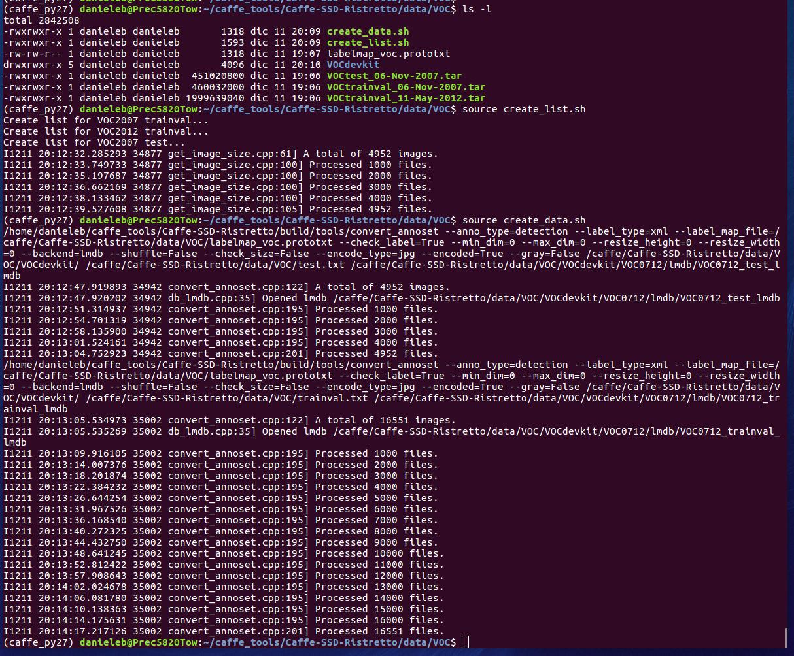
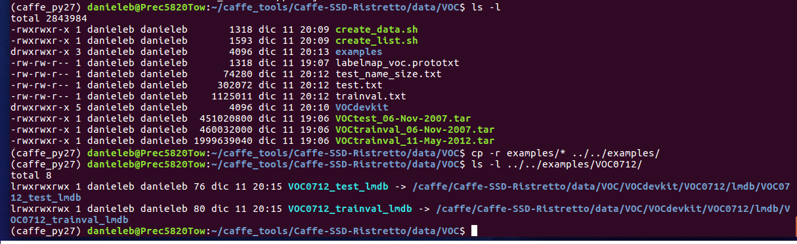
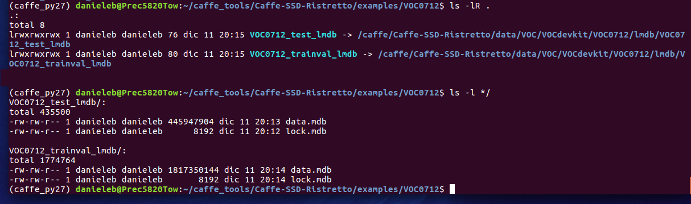
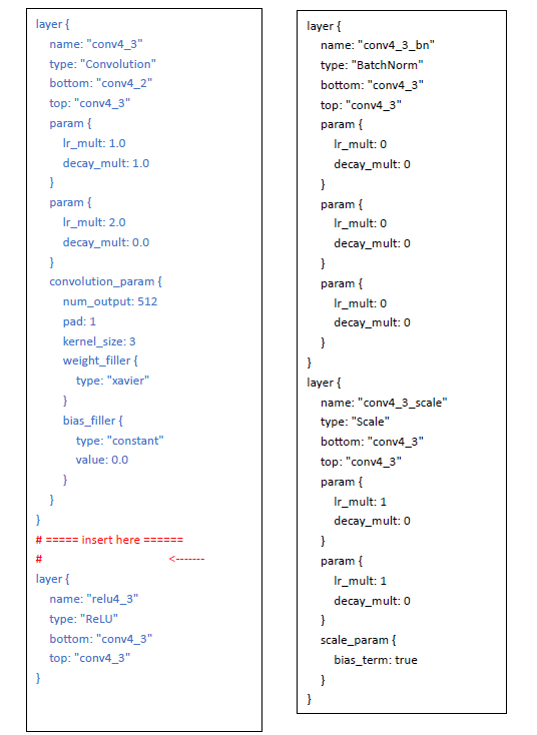
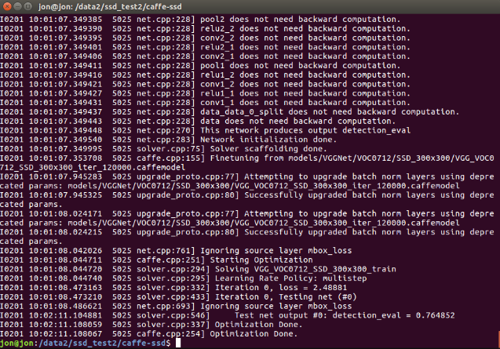
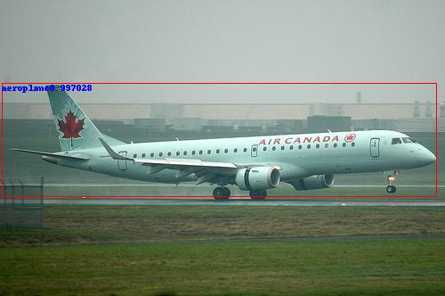
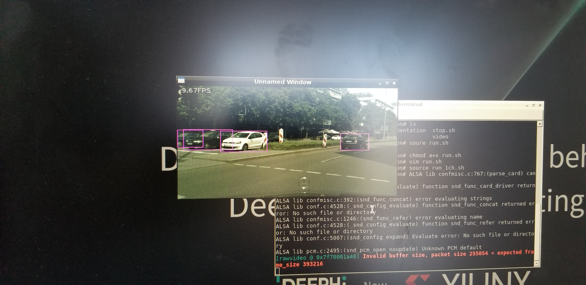

<table>
 <tr>
   <td align="center"><h1>Edge AI Tutorials</h1>
   </td>
 </tr>
 <tr>
 <td align="center"><h3>ML-SSD-PASCAL-Caffe-Tutorial</h3>
 </td>
 </tr>
</table>

The following is a tutorial on the SSD Object Detector, which is trained with Caffe on the [PASCAL VOC](http://host.robots.ox.ac.uk/pascal/VOC/voc2012/devkit_doc.pdf) dataset (which contains 20 classes).

The topics covered in this tutorial include how to train, quantize, and compile SSD using PASCAL VOC 2007/2012 datasets with the Caffe framework and the DNNDK tools, then deploy on a Xilinx® ZCU102 target board.

If you are new to the SSD network, the background information on the SSD network which has been compiled in the [SSD_0_Background.pdf](PDF/SSD_0_Background.pdf) should provide a helpful introduction.


The tutorial is organized as follows:

1.) Install the Caffe tool for SSD

2.) Prepare the dataset and database

3.) Train the SSD network

4.) Evaluate the Floating Point Network

5.) Quantize and Compile the Network

6.) Run the application on the ZCU102 board


# 1.0 Pre-Install Considerations for Caffe for SSD

SSD requires a special fork from Caffe:

The public version of SSD Caffe that is used by this tutorial was posted by [Wei Liu](http://www.cs.unc.edu/~wliu/).  This version of SSD Caffe is available at: https://github.com/weiliu89/caffe/tree/ssd

It is possible to install caffe in an environment such as Docker or use a virtual python environment, however, the instructions included with this tutorial cover only a direct installation on an Ubuntu 16.04 host PC with a GPU card.

The following instructions include:
- Installation of the ZCU102 image
- Configuration of the ZCU102 image
- Installation of the recommended SSD Caffe (distributed directly on the host machine)

These instructions can be viewed in section 1.1 Environment Setup and Installation.  

Whichever solution/environment you are using, after section 1.1, the content in this tutorial will assume that you have the recommended Caffe fork installed (either directly on your machine, in a python virtual environment, or within the Docker image) on your Ubuntu 16.04 Linux file system, and you have set the **$CAFFE_ROOT** environment variable with the following command into your **~/.bashrc** file (modify the file path for the location where the caffe-ssd exists):
```
export CAFFE_ROOT=/absolute_path_to_caffe_install/caffe-ssd
```

If you have successfully installed the correct fork of Caffe, the DNNDK tools, and configured your ZCU102 board with the Debian stretch image, then proceed to the step on dataset preparation.

# 1.1 Environment Setup and Installation

You will need an Ubuntu 16.04 or 14.04 host machine with an Nvidia GPU card as well as the proper CUDA, CuDNN, and NCCL libraries.  These dependencies are documented further in this section.

This tutorial assumes that you have the following:
- ZCU102 revision 1.0 or newer
- Displayport monitor
- USB keyboard and mouse
- USB hub with USB micro converter
- Deephi Demo Image for ZCU102:
http://www.deephi.com/assets/2018-10-11-ZCU102-desktop-stretch.img.zip.
This image needs to be written to an SD card using [Win32DiskImager](https://sourceforge.net/projects/win32diskimager/) or equivalent.

DNNDK user guide Tools for ZCU102 and Host x86:
http://www.deephi.com/technology/dnndk

## 1.1 PART 1: Deephi DNNDK and ZCU102 Image Setup:

The Deephi tools and image can be set up via the following steps:

1.) Download the [Deephi Demo Image](http://www.deephi.com/assets/2018-10-11-ZCU102-desktop-stretch.img.zip) for the ZCU102.

2.) Extract the ISO image from the zip file.

3.) If using Windows, install [Win32DiskImager](https://sourceforge.net/projects/win32diskimager/) and flash the image to a 16GB or larger SD card (this tutorial was verified using a [SanDisk Ultra 80MB/s 32GB SD card](https://www.amazon.com/SanDisk-Ultra-Class-Memory-SDSDUNC-032G-GN6IN/dp/B0143RT8OY).

4.) Boot the ZCU102 from the SD card with a USB keyboard and monitor connected.  If you are unsure how to configure the ZCU102 jumpers and switches, please refer to the [reVISION Getting Started Guide Operating Instructions](https://github.com/Xilinx/reVISION-Getting-Started-Guide/blob/master/operating-instructions.md).

5.) If using Windows, [PSCP](ref_training/pscp.exe) can be used to transfer the files from the ZCU102 to the host PC.  You can simply copy PSCP from (ref_training/) to the desired directory, cd to that directory with the Windows command prompt and use it.

6.) Open a command prompt/terminal in windows and cd to the directory of the PSCP application (if using Linux, you can use SCP).

7.) Connect an Ethernet cable from the ZCU102 board to your host machine and get the Ethernet IP address of the board using ifconfig in a terminal (mine was 192.168.0.102).

8.) Set the IP of your host machine to static on the same subnet such as 192.168.0.101.  If there is an anti-virus firewall on your host machine, you may need to disable it before proceeding to step 9.

9.) The [DNNDK tools and sample images](http://www.deephi.com/technology/dnndk) need to be copied to the board.  This can be done with PSCP using a command like the following (password is root):
`pscp –r c:\pathtodnndkfiles root@192.168.0.102:/root/`

10.)	Copy over the ZCU102 folder and the common folder included in the DNNDK tools and sample images downloaded in step 9 from the host machine to the ZCU102 board.

11.)	Install the DNNDK tools on the ZCU102 by running the provided install.sh script (./install.sh).

12.)	the x86 host tools can be copied to a linux x86 host machine to quantize/compile the model.

  12.a)	NOTE: To change the display resolution in the Ubuntu linux, execute the following:

-   `xrandr – q` to list the supported mo des

-   `xrandr –s 1920x1080` to set the mode

## 1.1 PART 2: Installing the Host Dependencies

The following guidelines are provided for direct setup on a host x86 Ubuntu machine with GPU:

1.) Install the dependencies:

  `sudo apt-get install -y libprotobuf-dev libleveldb-dev libsnappy-dev libopencv-dev libboost-all-dev libhdf5-serial-dev  python-numpy python-scipy python-matplotlib python-sklearn python-skimage python-h5py python-protobuf python-leveldb python-networkx python-nose python-pandas python-gflags ipython protobuf-c-compiler protobuf-compiler   libboost-regex-dev libyaml-cpp-dev g++ git make build-essential autoconf libtool libopenblas-dev libgflags-dev libgoogle-glog-dev libopencv-dev libprotobuf-dev protobuf-compiler libleveldb-dev liblmdb-dev libhdf5-dev libsnappy-dev libboost-system-dev libboost-thread-dev libboost-filesystem-dev libprotobuf-dev libleveldb-dev libsnappy-dev libopencv-dev libboost-all-dev libhdf5-serial-dev  python-numpy python-scipy python-matplotlib python-sklearn python-skimage python-h5py python-protobuf python-leveldb python-networkx python-nose python-pandas python-gflags ipython protobuf-c-compiler protobuf-compiler python-opencv python-numpy libyaml-dev libyaml-cpp-dev`

2.) Install the NVidia libraries/drivers.
  This tutorial was verified with the following configuration:

  - NVidia GTX 1080ti Graphics Card

-   NVidia 390 Graphics Drivers

  2.a) [CUDA v8.0](https://developer.nvidia.com/cuda-80-ga2-download-archive) (follow Nvidia instructions and install from the runfile along with the patch).

  2.b) [CuDNN v7.0.5](https://developer.nvidia.com/rdp/cudnn-archive) using the ”cuDNN v7.0.5 Library for Linux” selection for CUDA 8.0
  The following steps were used to install CuDNN:
```
  sudo tar -xzvf cudnn-9.1-linux-x64-v7.tgz
  sudo cp cuda/include/cudnn.h /usr/local/cuda/include
  sudo ln –s cuda/lib64/libcudnn* /usr/local/cuda/lib64
  sudo chmod a+r /usr/local/cuda/include/cudnn.h /usr/local/cuda/lib64/libcudnn*
```

  2.c) [NCCL v1.2.3](https://github.com/NVIDIA/nccl/releases) - The following steps were used to install:

  Download NCCL 1.2.3 (linked with CUDA 8.0) source code (tar.gz).
```
   tar –xvf nccl-1.2.3-1-cuda8.0.tar.gz
   cd nccl-1.2.3-1-cuda8.0
   sudo make install -j
   sudo ldconfig /usr/local/cuda/lib64
```

  2.d) Next create the symbolic links and an environment variable for hdf5:
```
   cd /usr/lib/x86_64-linux-gnu
   sudo ln –s libhdf5-serial.so.x.x.x libhdf5.so
   sudo ln –s libhdf5_serial_hl.so.x.x.x libhdf5_hl.so
   export CPATH=“/usr/include/hdf5/serial”
```
  This last line can also be added to ~/.bashrc to configure it on startup.

  2.e) Reboot your machine.

### NOTE: If issues are encountered where the graphics driver needs to be installed, please use the following instructions to install:

a. First remove other installations via the following:
```
  sudo apt-get purge nvidia-cuda*
  sudo apt-get purge nvidia-*
```

b. Enter a terminal session using ctrl+alt+F2

c. Stop lightdm: sudo service lightdm stop

d. Create a file at /etc/modprobe.d/blacklist-nouveau.conf with the following contents:

  - blacklist nouveau

  - options nouveau modeset=0

e. Then do: `sudo update-initramfs –u`

f. Add the graphics driver PPA:
```
  sudo add-apt-repository ppa:graphics-drivers
  sudo apt-get update
```

g. Now install and activate the latest drivers (for this tutorial, version 390):

`sudo apt-get install nvidia-390`

## 1.1 PART 3: Installing SSD Caffe
1.) Clone or Download the Distribution of [SSD Caffe](https://github.com/weiliu89/caffe/tree/ssd).

2.) Unzip the package and make a copy of Makefile.config.example and rename it “Makefile.config”.  At this point you should also export the $CAFFE_ROOT environment variable using a command something like
"export CAFFE_ROOT=/home/Caffe-SSD" (assuming the user has unzipped "caffe-ssd.zip" into the folder "/home/Caffe-SSD").  

3.) Edit the makefile.config as follows:

  3.a) Uncomment line 5 to enable the use of CUDNN.

  3.b) Ensure line 28 is to set CUDA_DIR := /usr/local/cuda (or wherever your CUDA install is located).

  3.c) On line 35, there is a definition for CUDA_ARCH.  Delete the lines that end in sm_20 and sm_21 (these are incompatible with the version of cuda being used).

  3.d) Edit line 90 and 91 to the following in the makefile.config:
```
  INCLUDE_DIRS:=$(PYTHON_INCLUDE) /usr/local/include /usr/include/hdf5/serial

  LIBRARY_DIRS:=$(PYTHON_LIB) /usr/local/lib /usr/lib /usr/lib/x86_64-linux-gnu /usr/lib/x86_64-linux-gnu/hdf5/serial
```
  If you installed many of the python packages using PIP, you may also need to edit the PYTHON_INCLUDE variable around line 64 of the Makefile.config to change the path to /usr/local/lib such as the following:
  `PYTHON_INCLUDE := /usr/include/python2.7 /usr/local/lib/python2.7/dist-packages/numpy/core/include`

4.) Edit the makefile to ensure the following:

  Line 409: add -D_FORCE_INLINES

5.) At this point, you will be able to cd to your caffe-master directory (this is the directory where the makefile exists – hereafter referred to as $CAFFE_ROOT) and run the following:
```
  make clean
  make –j8
  make py
```

6.) Next run a command similar to the following to export the PYTHONPATH variable:

`export PYTHONPATH= $CAFFE_ROOT/python:$PYTHONPATH`

At this point, Caffe-SSD is now installed and you may proceed to the section on dataset preparation.

# 2.0 Prepare the VOC database for SSD

To prepare the VOC0712 database use the following detailed instructions:

1.) Download the pre-trained: [VGG_ILSVRC_16_layers_fc_reduced_deploy.prototxt](https://gist.github.com/weiliu89/2ed6e13bfd5b57cf81d6) (description) and [VGG_ILSVRC_16_layers_fc_reduced.caffemodel](http://cs.unc.edu/~wliu/projects/ParseNet/VGG_ILSVRC_16_layers_fc_reduced.caffemodel) (weights) files of the VGG network.  These will be used as the backbone (feature extraction layers) for our SSD network and since they are pre-trained, it will help to reduce training time.

1.a) Copy these files into the **$CAFFE_ROOT/models/VGGNet/** folder.

2.) Download the PASCAL VOC dataset from the following three links:
- http://host.robots.ox.ac.uk/pascal/VOC/voc2012/VOCtrainval_11-May-2012.tar
- http://host.robots.ox.ac.uk/pascal/VOC/voc2007/VOCtrainval_06-Nov-2007.tar
- http://host.robots.ox.ac.uk/pascal/VOC/voc2007/VOCtest_06-Nov-2007.tar

2.a) Now create a folder named **$CAFFE_ROOT/data/VOC0712** and copy the 3 tar files above mentioned to that destination.  Extract all files from the 3 archives and merge them under a single VOCdevkit folder.

2.b) At the end of this process you should have a new folder named **$CAFFE_ROOT/data/VOC0712/VOCdevkit** which contains the VOC2007 and VOC2012 subfolders.  Note: This dataset contains the training, validation, and testing images as well as the annotations which are the bounding box locations contained in .xml format.


3.) For the next step, you will be processing the annotations (labels) and the training images into LMDB files which can then be directly used by Caffe for the training process.  

3.a) For this step, you need two shell scripts [create_list.sh](dataset_files/voc0712/create_list.sh) and [create_data.sh](dataset_files/voc0712/create_data.sh) which are available from this repository: https://github.com/intel/caffe/tree/master/data/VOC0712.

 3.b) These files are already downloaded for you and placed into this subfolder [dataset_files/voc0712](dataset_files/voc0712) along with one other file named [labelmap_voc.prototxt](dataset_files/voc0712/labelmap_voc.prototxt). Note: The two shell scripts are already edited in order to point to the **$CAFFE_ROOT/data/VOC0712** subfolder such that the first command in the scripts is as follows:
```
export DATAPATH=$CAFFE_ROOT/data/VOC0712
```
This uses the environment variable previously set for $CAFFE_ROOT, you can launch them from any folder in your Linux file system, though in the next instruction, you can copy them to a specific directory to make the instructions easier to follow.

Copy all these 3 files into **$CAFFE_ROOT/data/VOC0712**. If such directories do not exist you have to create them with the **mkdir** Linux command.

4.) Execute the following commands
and change the directory location:
```
cd $CAFFE_ROOT/data/VOC0712
source create_list.sh
source create_data.sh
cp -r examples/* ../../examples
```
At the end of following the recent steps, you should see something similar to what is illustrated in this example:


Note: A new directory named **examples** has been created together with **3 txt files**, as illustrated in the following example:


Note: This process created in **$CAFFE_ROOT/examples/VOC0712** has two soft links to the real LMDB databases stored in **$CAFFE_ROOT/data/VOC/VOCdevkit/VOC0712/lmdb**, respectively of size ~1.8GB the training validation database and 445MB the test database, as shown in the following example:


At this point, the training dataset has been prepared and is ready for use to train the SSD model and you can proceed to the next step which is training the model.

# 3.0 Training the SSD model

## 3.0 PART 1: Preparing the SSD Prototxt Files

1.) Open the following file with a text editor [$CAFFE_ROOT/examples/ssd/ssd_pascal.py](ref_training/ssd_pascal.py) and change line 332 to provide the ID numbers for GPUs which are available for training.  For more than one GPU, the line would read gpus = "0,1,2"
```
gpus = "0"
```

Notice that this python script adds layers to the existing VGGNet: these layers are the SSD framework layers, while the VGGNet that you previously downloaded will be the feature extraction layers or backbone.

Note: This python script will create [solver.prototxt](ref_training/default_solver.prototxt), [deploy.prototxt](ref_training/deploy.prototxt), [test.prototxt](ref_training/test.prototxt), and [train.prototxt](ref_training/train.prototxt) files for the SSD network with the all  necessary parameters.
These will all be created under **$CAFFE_ROOT/models/VGGNet/VOC0712/SSD_300x300**.
View the prototxt files and note that they all assume to have the LDMB database placed in the
**$CAFFE_ROOT/examples/VOC0712/VOC0712_test_lmdb** folder, therefore the previous steps in [dataset preparation](ssd2_VOC_dataset.md) ensure that you have some soft links that point to the actual place where you might have placed the database when you first created it in the step described by [ssd2_VOC_dataset.md](ssd2_VOC_dataset.md).

To start the training and create the prototxt files, use the following command:
```
cd $CAFFE_ROOT
python examples/ssd/ssd_pascal.py
```

Output snapshots will be incrementally created under the following directory: **$CAFFE_ROOT/models/VGGNet/VOC0712/SSD_300x300**, though at this point you will need to halt the training process early on by entering **CTRL+C** in the terminal.  **The rationale is so you can halt the training process to make some manual modifications to the prototxt files for compatibility with the DPU and DNNDK tools.**

## 3.0 PART 2: Modifying the SSD Prototxt Files for Compatibility with the DPU/DNNDK
1.) At this point you should have prototxt and solver files under $CAFFE_ROOT/jobs/VGGNet/VOC0712/SSD_300x300. You need to make a copy of the "train.prototxt" and rename it to "train_test.protoxt".  The following steps will walk through a number of edits to this train_test.prototxt file to make it compatible with the DPU/DNNDK.  If you would like to skip ahead to step 7, you can simply copy the provided [train_test.prototxt](ref_training/train_test.prototxt) file to $CAFFE_ROOT/jobs/VGGNet/SSD_300x300 directory.

2.) Next open the test.prototxt file and copy the first layer (named “data”) to train_test.prototxt as the second layer.  Make sure to omit copying the 1st line of the test.prototxt which is the name.  You should be inserting this layer between lines 137 and 138 of the "train_test.prototxt" file.

3.) Next copy the last 5 layers from "test.prototxt" (starting at the layer named "mbox_conf_reshape" which should be around line 1591, ending at the last layer) and append them to the end of "train_test.prototxt"

4.) Next, you need to add a parameter to the **mbox_conf_reshape**, **mbox_conf_softmax**, and **mbox_conf_flatten** layers that were just added to ensure these layers are only used for testing.  The entry that needs to be added is as follows:
```
include{
  phase: TEST
}
```

This can be inserted in each of the layers just after the **top:** declaration and before the layers other parameters.

5.)  In the "train_test.prototxt" you now need to replace the Normalize layer with BatchNorm and Scale layers because the DPU does not support Normalize.  In the original SSD model, this is called "conv4_3_norm".  The following steps can be used to replace the layer:

5.a) Delete the Normalize layer named "conv4_3_norm" which should start at around line 972 and end around line 985.

5.b) Insert the Batchnorm layer and scale layer between "conv4_3" and "relu4_3" layers.

5.c)  Replace the other bottom layers in the prototxt named "conv4_3_norm" with "conv4_3" (there should be three of these) and they appear as `bottom: "conv4_3_norm"`.

The following illustration should help with these modifications: 

6.) Next modify the "fc6" layer by changing the num_output to 682 instead of 1024.  The reason for this is that the DPU only supports 12 bits to describe the number of parameters.  With a dilation of 6, the number of output parameters will be 6143 which is too many for the DPU to capture.

**Because of this change to the layer, you will need to rename both fc6 and fc7 layers both in the layers themselves as well as the layers to which they connect.  To do this, I would recommend simply doing a find/replace the name "fc6" with "fc6_682" and the name "fc7" with "fc7_682".**

Note: A pre-modified version of the [train_test.prototxt](ref_training/train_test.prototxt) is included for your reference.  Note that one difference between your modified train_test.prototxt and the provided one will be the output_directory from detection_output layer.  This directory isn't used by this tutorial, but you may change it to another location if desired.

7.)  Open the "solver.prototxt" which exists in this same directory.  This file has the training hyper-parameters and also points to the net which is being trained.  In this file, delete the first two lines:

```
train_net: "models/VGGNet/VOC0712/SSD_300x300/train.prototxt"
test_net: "models/VGGNet/VOC0712/SSD_300x300/test.prototxt"
```

and replace these with the following line:
```
net:  "jobs/VGGNet/VOC0712/SSD_300x300/train_test.prototxt"
```

Notice the snapshot_prefix location which is where the training will produce output models.  This can be modified as desired to place the snapshot output model in a desired directory, though for this tutorial, leaving the snapshots at this location with the recommended prefix as it will allow for easier evaluation of the floating point model without modifying other scripts.

```
snapshot_prefix: "models/VGGNet/VOC0712/SSD_300x300/VGG_VOC0712_SSD_300x300"
```
The number/frequency of snapshots are determined based on the parameters specified in the "solver.prototxt" and note that by default the first snapshot will occur after 80K iterations.

I have also included an example [solver.prototxt](ref_training/solver.prototxt) for your reference.

8.) Next open the [VGG_VOC0712_SSD_300x300.sh](ref_training/VGG_VOC0712_SSD_300x300.sh) script (which should exist in the $CAFFE_ROOT/jobs/VGGNet/SSD_300x300 directory) in a text editor and modify the --solver path to point to the solver.prototxt file in the jobs directory.

```
--solver="jobs/VGGNet/VOC0712/SSD_300x300/solver.prototxt"
```
9.) The training process requires about 10GB of GPU memory in the current configuration.  If your GPU does not have sufficient memory, you can modify the train_test.prototxt file and change the batch_size parameter in the input layers to a smaller value such as 8, 4, 2, or 1.  

Since the training typically uses a batch_size of 32, if you modify this value, you should also change the solver.prototxt iter_size parameter such that the product of iter_size x batch_size = 32.  For instance, if you change the batch_size to be 8, you should change the iter_size to be 4 so that the effective batch size used for the training process is 4x8 = 32.  

10.) cd to $CAFFE_ROOT and run the following:

```
./jobs/VGGNet/VOC0712/SSD_300x300/VGG_VOC0712_SSD_300x300.sh
```
This will call the `./build/tools/caffe train` command pointing to the newly created "train_test.prototxt" file.

The 120K iterations training process takes about 20-30 hours on a Xeon machine with a GTX 1080 ti graphics card and about 28 hours on a DELL5820 machine with Quadro P6000 GPU.

Here is an example log file of the whole training process: [logfile_ssd_pascal.txt](ref_training/logfile_ssd_pascal.txt), if everything goes smoothly you will get something very similar.

The model has been trained and is now ready for Evaluation.  If you would like to skip evaluating the floating point model and jump straight to quantization, that is also possible.

# 4.0 Evaluating the Floating Point SSD Model on the Host

Once the model has been trained, you will see .caffemodels and .solverstates appear in the snapshot_prefix directory as defined in the the ["solver.prototxt"](ref_training/solver.prototxt).  If left unchanged, this directory is located at the following with the filename prefix "VGG_VOC0712_SSD_300x300" + the iteration number:

```
snapshot_prefix: "models/VGGNet/VOC0712/SSD_300x300/"
```
At this point, it is possible to test the model with a web camera, score the network, and evaluate it against a single image from the test dataset.

I have included some example scripts that can be used to evaluate the floating point network models.  These scripts can be found in the [ref_training/evaluation folder](ref_training/evaluation/).

**IMPORTANT: These scripts will run forward inference on the 120K iteration trained model.  If you don't have this model, simply open the scripts ([score.sh](ref_training/evaluation/score.sh) and [webcam.sh](ref_training/evaluation/webcam.sh)) and change the model name to the model that you do have available.**

**IMPORTANT: Before running the scripts, you need to copy the evaluation folder to your $CAFFE_ROOT directory**

The following instructions show how to run two different scripts: one that works by continually grabbing frames from a web camera, and one that uses the test dataset to score the network.  

Note that on my Xeon machine with one GTX 1080ti GPU card, the webcam version gets around 30FPS.

## 4.0 PART 1: Testing with a Web Camera
Note that the webcam evaluation uses a prototxt file that I have created which should match your train_test.prototxt except for differences in the input and output layers.  If this prototxt does not match your train_test.prototxt, then you will need to create a new [webcam.prototxt](ref_training/evaluation/webcam.prototxt) file that matches the input/output layers that I have specified and uses the architecture layers that are contained in your train_test.prototxt.

1.) Connect a web camera to your host PC.  This step has been tested with the [eCON USB SEECam 3.4 MP camera](https://www.e-consystems.com/ar0330-lowlight-usb-cameraboard.asp) and a [Logitech C920 camera](https://www.logitech.com/en-us/product/hd-pro-webcam-c920).

2.) Change your directory to $CAFFE_ROOT and then enter the following command:
```
./evaluation/webcam.sh
```
NOTE: if you changed the location of the snapshots or want to evaluate a model other than the VGG_VOC0712_SSD_300x300_iter_120000.caffemodel, you will also need to modify the script above and specify the correct path to your caffemodel.

## 4.0 PART 2: Scoring the Network
1.) In order to score the network, change directory to $CAFFE_ROOT and then enter the following command:
```
./evaluation/score.sh
```
NOTE: if you changed the location or name of the snapshots during training or want to evaluate a different model, you will also need to modify the script above and specify the correct path to the model.

I have included a screenshot below which shows the scoring output of 0.764852 on my machine: 


## 4.0 PART 3: Single Image Evaluation
1.) In order to run a single image evaluation, I have included the [detect.sh](ref_training/evaluation/detect.sh) script and [deploy.prototxt](ref_training/evaluation/deploy.prototxt) files which can be used to evaluate single images.  I have also included an example [input image](ref_training/evaluation/001107.jpg) from the PASCAL dataset.  To run the detection on a single image, simply change directory to $CAFFE_ROOT and run the following command:

```
./evaluation/detect.sh
```

This process calls the python script ssd_detect.py which exists under the $CAFFE_ROOT/examples/ssd directory.  The resultant output image for the detection should be written into the $CAFFE_ROOT directory

NOTE: if you changed the location or name of the snapshots during training or want to evaluate a different model, you will also need to modify the script above and specify the correct path to the model.

Below you can see the input image:


And the resulting output image:

.

At this point, you have tested the trained SSD model on the host machine and can proceed to the [quantization step](ssd5_Quantization.md).

## 4.0 PART 4: Other Evaluations
There are a number of other scripts contained in the $CAFFE_ROOT/examples/ssd directory which can be used.  You can typically call each script with a -h argument for help on how to construct the arguments for that command line.

Note: You do need to take care when running these python scripts because some of them will re-create the prototxt files that exist under the $CAFFE_ROOT/jobs/VGGNet/VOC0712/SSD_300x300 directory and they also may not point by default to the correct caffemodel/prototxt.  Please check each script in detail before attempting to use it to evaluate the model.

# 5.0 Quantizing the SSD network for DPU implementation
## 5.0 PART 1: Installing the DNNDK tools

In [section 1](ssd1a_Install_Caffe.md), we downloaded the [DNNDK tools](http://www.deephi.com/technology/dnndk) and copied them over to the ZCU102 board.  A portion of these tools also need to be installed on the host x86 machine for quantizing and compiling the model.

The tools needed are contained under the host_x86 tools directory.

1.) Copy the host_x86 folder and its subdirectories to the host machine.

2.) Cd into the host_x86 directory run the following to install the host tools:

```
sudo ./install.sh ZCU102
```
Note: The target for this tutorial is the ZCU102 per the command line above, though other hardware targets may be specified as indicated by the corresponding version of the [DNNDK User Guide](http://www.deephi.com/assets/ug1327-xilinx-dnndk-user-guide.pdf).  Refer to the user guide for more details on the DNNDK tools.

## 5.0 PART 2: Configuring the Files for Quantization and Compilation:

1.) An example workspace is included in [ref_training/DNNDK_Project](ref_training/DNNDK_Project) to show how the DNNDK tools may be invoked as well as the necessary modifications to the prototxt file.  **Copy this DNNDK folder into your $CAFFE_ROOT**.

2.) Open the [float.prototxt](ref_training/DNNDK_Project/float.prototxt) that is included as an example in the [DNNDK_Project](ref_training/DNNDK_Project) directory.

This [float.prototxt](ref_training/DNNDK_Project/float.prototxt) should be nearly identical to your [train_test.prototxt](ref_training/train_test.prototxt) with a few  modifications:

The input layers have been modified to specify paths to the calibration data as well as to enable the autotest capabilities within DNNDK.  The following paths have been specified in a relative fashion so that they point to the correct locations when copied into $CAFFE_ROOT:

  ```
line 55:   source: "../examples/VOC0712/VOC0712_test_lmdb"
line 62:   label_map_file: "../data/VOC0712/labelmap_voc.prototxt"
line 1706: output_directory: "./test_results"
line 1709: label_map_file: "../data/VOC0712/labelmap_voc.prototxt"
line 1710: name_size_file: "../data/VOC0712/test_name_size.txt"
```

If you would like to ensure this essentially matches your prototxt, you can diff the two with the command line or a text editor such as VSCode.

3.)  Copy your latest trained model from Caffe into the **DNNDK_Project** directory and rename it "float.caffemodel".  Assuming you ran the full 120K training iterations, this model should have the following location and name:

```
 "$CAFFE_ROOT/models/VGGNet/VOC0712/SSD_300x300/VGG_VOC0712_SSD_300x300_iter_120000.caffemodel"
```

4.) Run the quantization tools by changing the directory to the **DNNDK_Project** and running the following command:

```
./decent_ssd.sh
```

If you open the script, you will see the following contents which indicate that the command being called is `decent quantize` and a number of parameters are being passed to it, including the GPU ID to use for the testing, the location of the floating point prototxt and caffemodel, and the auto_test option which will force a test after quantization to measure the mAP%.
```
work_dir=$(pwd)
model_dir=${work_dir}
output_dir=${work_dir}/decent_output
decent    quantize                                    \
          -model ${model_dir}/float.prototxt     \
          -weights ${model_dir}/float.caffemodel \          
          -output_dir ${output_dir} -gpu 0 -auto_test
```      
For reference, a [decent log file](ref_training/decent_log.txt) is included that shows the console output when running this command.  You should see something similar after running the command on your machine.  Note that the loss is reported as '0' during the quantization process.  In actuality the process is working properly, but for detection and segmentation networks, the decent tools are not able to properly report the loss.  The reported accuracy that I get from the quantization process is **0.78364** and you should see something within +/- 5% of this number for your network assuming 120K training iterations with the same training setup/dataset.

5.)  After step 4, you should see a "deploy.prototxt" and "deploy.caffemodel" in the **decent_output** directory.  At this point, you can call the following command to compile the model into an executable file that can be run on the DPU.

```
./dnnc_ssd.sh
```
If you open the script, you will see the following contents which indicate that the command being called is `dnnc` and a number of parameters are being passed to it, including the location of the deploy prototxt and caffemodel, the DPU hardware target (in this case the 4096FA which is used in the ZCU102 image), the cpu architecture (in this case arm64 for the cortex-A53 cores), and the net name.
```
net=ssd
model_dir=decent_output
output_dir=dnnc_output

dnnc --prototxt=${model_dir}/deploy.prototxt     \
       --caffemodel=${model_dir}/deploy.caffemodel \
       --output_dir=${output_dir}                  \
       --net_name=${net}                           \
       --dpu=4096FA                                 \
       --cpu_arch=arm64                         
```
For reference, a [dnnc log file](ref_training/dnnc_log.txt) is included that shows the output of my console when running this command.  You should see something similar after running the command on your machine.

At this point, an elf file should have been created in the **dnnc_output** directory which can be used in the final step which is to run the model on the ZCU102.

# 6.0 Running the SSD Model on the ZCU102
The final step of this tutorial is to run the trained and compiled model on the ZCU102 board.  In order to make this step fast and easy, an example application contained within the [ZCU102_Application](ref_training/ZCU102_Application) directory is included.  

1.) The first step that needs to be done by the user is to copy your ssd compiled .elf file into the **model** directory and name it **dpu_ssd.elf**.

Note: That the directory structure contains the following:

- [Makefile](ref_training/ZCU102_Application/Makefile): Used to build the application on the ZCU102 and link both the software application .elf with the compiled SSD model .elf.

- [run.sh](ref_training/ZCU102_Application/run.sh) file: Used to execute the application on the target by running `source run.sh` on the ZCU102.

- [stop.sh](ref_training/ZCU102_Application/stop.sh) file: Used to stop the execution on the target by running `source stop.sh` on the ZCU102.

- [model](ref_training/ZCU102_Application/model) directory: This is the directory where you need to copy your compiled model executable and make sure it is named **dpu_ssd.elf**.

- [src](ref_training/ZCU102_Application/src) directory: This directory contains the ARM source code that will be executed to read in a video file, resize it, and call the DPU APIs to process the images and then display the output with overlays on a displayport monitor.

It is recommended to review the source files in detail as these will help you understand how the output of the SSD model is processed.  It is performing a couple steps in software including softmax which reforms the class outputs in terms of probabilities ranging between 0 and 1 (in newer versions of the DPU, this can be executed in the DPU rather than software) and non-maxima suppresion (NMS) which essentially discards overlapping detections of low probabilities.

[video](ref_training/ZCU102_Application/video) directory: Due to github file size restrictions this directory is currently empty but the user should add a video file to evaluate the network against.  

2.) There is a video that is part of the DNNDK image which exists under deephi_dnndk_v2.08_beta/ZCU102/samples/adas_detection/video/adas.avi.  Copy this video file into the video directory of the ZCU102_Application.  If the DNNDK image does not exist on the host machine, you can execute this step on the ZCU102 target after step 3.

3.) The next step is to copy this application folder back to your ZCU102 board using scp or pscp via an Ethernet connection.  This can be done similar to the steps outlined in the [installation guidelines](ssd1a_Install_Caffe.md).  Note: This assumes that you have set your IP address on both your host machine and the target as indicated in the guidelines.

```
pscp –r path_to_ZCU102_Application root@192.168.0.102:/root/
```

4.) On the ZCU102, change the directory to the ZCU102_Application directory and run `make`

5.) You can run the application by entering:

```
source run.sh
```
At this point, you should see the video load and playback with bounding boxes being drawn around the detections that are output from the SSD model.  Note that the video being supplied to the model is from the Cityscapes dataset, so the accuracy is not as good as it would have been using data from the PASCAL database (this is different video data that the model has not seen before).  

There may also be some miscellaneous software errors/warnings in the console, though these can be safely ignored for the purposes of the demonstration.  

An example of this running on my ZCU102 can be seen below: 

6.) You can stop the application by hitting **CTRL+C** on the terminal and entering:

```
source stop.sh
```
In summary, this tutorial has demonstrated how to train SSD and deploy it in a Xilinx SoC from start to finish including installing the Caffe framework for SSD, preparing the PASCAL VOC dataset, training the SSD network, evaluating the floating point model, quantizing and compiling that model, and finally deploying the application on the ZCU102 board.  An additional step that could be taken to significantly enhance the performance of the SSD model would be to prune the model, though that step is not included in this tutorial as it requires a software license.
